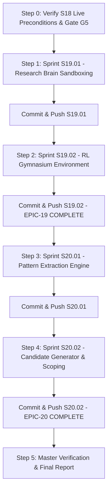

# AUTONOMOUS EXECUTION DIRECTIVE: SPRINTS S18 TO S20
## Autonomous Unattended Execution Specification for AI Trader

| | |
|---|---|
| **Pipeline Title** | Autonomous Pipeline: S18 Verification through S20 Delivery |
| **Document Role** | Unattended Autonomous Execution Directive |
| **Execution Trigger** | `/goal Execute AUTONOMOUS_RUN_S18_TO_S20.md entirely without human pause` |
| **Target Sprints** | S18 (Verification Gate), S19.01, S19.02, S20.01, S20.02 |
| **Target Epics** | EPIC-18 (Phase V5), EPIC-19 (Phase V6), EPIC-20 (Phase V6) |
| **Target Git Branch** | `implementation-develop` |
| **Status** | READY FOR AUTONOMOUS RUN |

---

## 1. Unattended Operational Directives (CRITICAL RULES)

When this directive is activated (e.g. via `/goal` or when the operator steps away), the AI agent must operate under **100% autonomous unattended execution mode**:

1. **Zero Human Confirmation Pauses**:
   - Do **NOT** pause to ask the operator for confirmation between tasks, between sprints, or when running tests.
   - Proceed sequentially and autonomously through all sprints until the entire directive is complete.
2. **Deterministic Fail-Stop & Self-Correction**:
   - If any test, linter, type check (`mypy`), or safety isolation check fails, do **NOT** stop or give up.
   - Analyze the root cause, apply clean drop-in fixes, re-verify until 100% passing, and continue.
   - Hard risk limit: Never bypass risk controls, never weaken type annotations, never allow secrets into git.
3. **Mandatory Delivery Cycle per Sprint**:
   Every sprint (S19.01, S19.02, S20.01, S20.02) must complete the standard 7-step delivery cycle:
   ```
   1. Implement Core Code in src/
   2. Implement Comprehensive Unit & Integration Tests in tests/
   3. Run Quality Toolchain (Ruff lint/format, Mypy strict, verify_safety_isolation.py, Pytest)
   4. Update Task Specifications in docs/tasks/TASK-*.md (Status: COMPLETE)
   5. Update Sprint Specification in docs/sprints/S*.md (Status: COMPLETE)
   6. Append Delivery Log in SPRINT_DELIVERY.md & Update STORY.md
   7. Execute .\scripts\deliver_sprint.ps1 to commit and push to origin/implementation-develop
   ```
4. **Immediate Next Sprint Auto-Advance**:
   - Once a sprint is pushed, advance immediately to the next sprint in the pipeline without delay.

---

## 2. Pipeline Execution Sequence



---

## 3. Step-by-Step Autonomous Sprint Tasks

### Step 0: Sprint S18 Gate G5 Verification (Phase V5 Live Activation)
- **Objective**: Confirm Phase V5 live trading activation is healthy and all 614 existing tests pass.
- **Commands**:
  ```powershell
  $env:PATH = "$env:USERPROFILE\.local\bin;$env:PATH"
  uv run python scripts/verify_live_preconditions.py --json
  uv run pytest tests/integration/test_live_activation.py -q
  uv run pytest -q
  ```
- **Exit Gate**: 614/614 tests passing, zero errors. Proceed immediately to Step 1.

---

### Step 1: Sprint S19.01 — Research Brain Physical Isolation & Sandboxing
- **Parent Epic**: `EPIC-19: Research Brain Infrastructure & Sandboxing` (Phase V6)
- **Governing Specs**: BRD BR-6; FRD Module 10 (FRD-LEARN-1); TRD-ARCH-2; HLD §10; ADD §10.
- **Task**: `TASK-19-01-001: Implement Research Brain Execution Environment and Boundary Guards`
- **Implementation Deliverables**:
  1. `src/research/__init__.py`: Package export marker.
  2. `src/research/environment.py`:
     - `ResearchBrainEnvironment` class managing sandboxed runtime configuration.
     - Read-only database access to historical candles, feature stores, and past `DecisionRecordModel` rows.
     - **Enforce Boundary Invariant (TRD-ARCH-2, FRD-X-4)**: Research Brain has zero access to broker credentials (`api_key`, `api_secret`, `access_token`), cannot load `LiveBrokerAdapter`, and raises `PermissionError` if live order placement or database writes to `positions` or `order_submissions` are attempted.
     - Structural boundary check: runtime AST inspect preventing execution module imports inside research routines.
  3. `docker/Dockerfile.research`: Separate container definition with non-privileged user and read-only DB role.
- **Testing Deliverables**:
  1. `tests/unit/research/test_environment.py`:
     - Unit tests verifying read-only historical queries.
     - Security tests asserting failure when attempting live order placement or mutating positions.
     - Boundary isolation test asserting that broker credentials cannot be injected or resolved.
  2. `tests/integration/test_research_isolation.py`:
     - Cross-module test confirming structural physical isolation between Trading Brain and Research Brain.
- **Verification & Delivery**:
  - Run `uv run ruff check`, `uv run mypy src tests`, `uv run pytest tests/unit/research/`.
  - Update `docs/tasks/TASK-19-01-001.md` and `docs/sprints/S19.01-research-brain-physical-isolation-sandboxing.md` to `COMPLETE`.
  - Append `DELIV-036` to `SPRINT_DELIVERY.md` and update `STORY.md`.
  - Execute:
    ```powershell
    powershell -ExecutionPolicy Bypass -File .\scripts\deliver_sprint.ps1 -SprintId "S19.01" -SprintName "Research Brain Physical Isolation & Sandboxing" -Summary "ResearchBrainEnvironment, read-only historical data access, structural execution isolation, security tests"
    ```

---

### Step 2: Sprint S19.02 — RL Sandboxed Training Environment
- **Parent Epic**: `EPIC-19: Research Brain Infrastructure & Sandboxing` (Phase V6) (**100% COMPLETE upon delivery**)
- **Governing Specs**: PRD FR-24; FRD-LEARN-9; ADD §11; TRD-ML-4.
- **Task**: `TASK-19-02-001: Implement Gymnasium Trading Environment with Multi-Factor Reward Function`
- **Implementation Deliverables**:
  1. `src/research/rl/__init__.py`: Package export marker.
  2. `src/research/rl/reward.py`:
     - `MultiFactorRewardCalculator`: Calculates multi-factor RL reward per ADD §11:
       $$R_t = r_t - \lambda_{\text{dd}} \cdot \text{DrawdownPenalty} - \lambda_{\text{vol}} \cdot \text{VolPenalty} - \text{CostDrag}$$
       incorporating net portfolio return, maximum drawdown penalty, return volatility penalty, and Indian statutory transaction cost drag (`CostModel`).
  3. `src/research/rl/environment.py`:
     - `TradingEnv` adhering to Gymnasium standard interface (`reset`, `step`, `render`).
     - Observation space: normalized feature vector from `FeatureEngine` (technical indicators + regime state).
     - Action space: strictly constrained to `AgentSignalOutput` $[0, 1]$ confidence and direction (`BUY`, `SELL`, `HOLD`, `NO_TRADE`).
     - **Safety Guard**: Action space has ZERO access to position sizing or risk limits (ADD §11).
- **Testing Deliverables**:
  1. `tests/unit/research/test_rl_environment.py`:
     - Unit tests verifying Gymnasium interface compliance (`reset`, `step`, observation shape, action masking).
     - Multi-factor reward calculation tests asserting correct penalty application for high drawdown and excessive churn.
     - Deterministic step-by-step episode trajectory validation.
- **Verification & Delivery**:
  - Run full toolchain; verify coverage $\ge 80\%$.
  - Update `docs/tasks/TASK-19-02-001.md` and `docs/sprints/S19.02-rl-sandboxed-training-environment.md` to `COMPLETE`.
  - Append `DELIV-037` to `SPRINT_DELIVERY.md`; update `STORY.md` (EPIC-19 100% Complete, Milestone 39).
  - Execute:
    ```powershell
    powershell -ExecutionPolicy Bypass -File .\scripts\deliver_sprint.ps1 -SprintId "S19.02" -SprintName "RL Sandboxed Training Environment" -Summary "Gymnasium TradingEnv, multi-factor reward function with drawdown & cost penalties, constrained action space, EPIC-19 complete"
    ```

---

### Step 3: Sprint S20.01 — Multi-Trade Variance Driver Pattern Extraction
- **Parent Epic**: `EPIC-20: Post-Trade Analytics & Variance Classification` (Phase V6)
- **Governing Specs**: FRD Module 10 (FRD-LEARN-2); SLD §5, §6; MLD §10.
- **Task**: `TASK-20-01-001: Implement PatternExtractionEngine`
- **Implementation Deliverables**:
  1. `src/domain/pattern.py`:
     - `ObservedPattern` canonical domain entity containing: `pattern_id`, `regime_dimension`, `agent_name`, `variance_driver`, `sample_size`, `win_rate`, `profit_factor`, `p_value`, `statistical_significance`, `timestamp`.
  2. `src/research/pattern_detector.py`:
     - `PatternExtractionEngine`: Aggregates historical `TradeEvaluation` and `DecisionRecord` data.
     - Minimum sample size threshold: $\ge 30$ trades per cohort (SLD §10) to reject sub-sample noise.
     - Statistical hypothesis testing (binomial / t-test) to detect statistically significant underperformance clusters by regime dimension, contributing agent, and variance driver.
     - Outputs strongly-typed `list[ObservedPattern]` with zero mutation of live trading parameters.
- **Testing Deliverables**:
  1. `tests/unit/research/test_pattern_detector.py`:
     - Synthetic trade outcome distribution tests with injected failure clusters (e.g. TrendAgent in High-Volatility Sideways regime).
     - Sample size filter tests verifying rejection of underpowered samples ($<30$ trades).
     - Noise rejection tests verifying that random walk variance does not produce false patterns.
- **Verification & Delivery**:
  - Run full toolchain; verify coverage $\ge 80\%$.
  - Update `docs/tasks/TASK-20-01-001.md` and `docs/sprints/S20.01-multi-trade-variance-driver-patterns.md` to `COMPLETE`.
  - Append `DELIV-038` to `SPRINT_DELIVERY.md`; update `STORY.md` (Milestone 40).
  - Execute:
    ```powershell
    powershell -ExecutionPolicy Bypass -File .\scripts\deliver_sprint.ps1 -SprintId "S20.01" -SprintName "Multi-Trade Variance Driver Pattern Extraction" -Summary "ObservedPattern domain model, PatternExtractionEngine with sample size filtering (>=30) and statistical significance detection"
    ```

---

### Step 4: Sprint S20.02 — Scoped Hypothesis & Candidate Generation Workflow
- **Parent Epic**: `EPIC-20: Post-Trade Analytics & Variance Classification` (Phase V6) (**100% COMPLETE upon delivery**)
- **Governing Specs**: FRD-LEARN-2; SLD §6, §8, §10; ADD §10.
- **Task**: `TASK-20-02-001: Implement CandidateGenerator and Scoping Engine`
- **Implementation Deliverables**:
  1. `src/research/candidate_generator.py`:
     - `CandidateGenerator`: Converts structured `ObservedPattern` into a scoped, validated `ModelVersion` candidate.
     - **One-Change-at-a-Time Discipline (SLD §6.2)**: Strictly disallows simultaneous multi-parameter mutations.
     - **Concurrency Limit (SLD §8)**: Strictly caps active validation queue at maximum 1 candidate model at any time.
     - **Cooldown Enforcement (SLD §8)**: Enforces mandatory 30-trade cooldown period per agent/parameter domain before another candidate can be proposed.
     - Stores proposed candidates in database as `ModelVersion` with `status = "candidate"`.
- **Testing Deliverables**:
  1. `tests/unit/research/test_candidate_generator.py`:
     - Unit tests verifying candidate generation from `ObservedPattern`.
     - Cooldown enforcement tests asserting rejection of candidates generated before 30-trade interval.
     - Concurrency limit tests asserting rejection of new candidates when 1 candidate is already pending.
     - One-change-at-a-time invariant tests rejecting compound mutation requests.
- **Verification & Delivery**:
  - Run full toolchain; verify coverage $\ge 80\%$.
  - Update `docs/tasks/TASK-20-02-001.md` and `docs/sprints/S20.02-scoped-hypothesis-candidate-generation.md` to `COMPLETE`.
  - Append `DELIV-039` to `SPRINT_DELIVERY.md`; update `STORY.md` (EPIC-20 100% Complete, Milestone 41).
  - Execute:
    ```powershell
    powershell -ExecutionPolicy Bypass -File .\scripts\deliver_sprint.ps1 -SprintId "S20.02" -SprintName "Scoped Hypothesis & Candidate Generation Workflow" -Summary "CandidateGenerator with 1-change discipline, 1-candidate concurrency cap, and 30-trade cooldown enforcement, EPIC-20 complete"
    ```

---

### Step 5: Master Pipeline Verification & Final Report
- **Objective**: Execute global repository-wide regression, security scan, and push validation.
- **Verification Checks**:
  1. `uv run ruff check .` $\to$ Clean pass.
  2. `uv run ruff format --check .` $\to$ Clean pass.
  3. `uv run mypy src tests scripts` $\to$ Clean pass across $\ge 185$ source files.
  4. `uv run python scripts/verify_safety_isolation.py` $\to$ Clean PASS.
  5. `uv run pytest` $\to \ge 660$ tests passing, global branch coverage $\ge 95\%$.
  6. `uv run pre-commit run --all-files` $\to$ All hooks passed, 0 secrets detected.
  7. `git status` $\to$ Working tree clean, branch up-to-date with `origin/implementation-develop`.
- **Output Artifact**: Create/update `walkthrough.md` with complete Phase V6 milestone accomplishments.

---

## 4. How to Trigger Autonomous Execution

### Method 1: Antigravity Goal Command (Recommended)
Before stepping away, run the following slash command in chat:
```
/goal Execute AUTONOMOUS_RUN_S18_TO_S20.md entirely without human pause
```

### Method 2: Direct Shell Automation (Companion Script)
Run the automated supervisor script from PowerShell:
```powershell
powershell -ExecutionPolicy Bypass -File .\scripts\run_sprints_18_to_20.ps1
```
