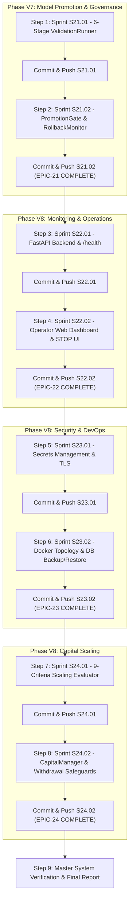

# AUTONOMOUS EXECUTION DIRECTIVE: SPRINTS S21 TO S24
## Autonomous Unattended Execution Specification for AI Trader (Phase V7 & Phase V8)

| | |
|---|---|
| **Pipeline Title** | Autonomous Pipeline: Sprints S21 through S24 Delivery |
| **Document Role** | Unattended Autonomous Execution Directive |
| **Execution Trigger** | `/goal Execute AUTONOMOUS_RUN_S21_TO_S24.md entirely without human pause` |
| **Target Sprints** | S21.01, S21.02, S22.01, S22.02, S23.01, S23.02, S24.01, S24.02 |
| **Target Epics** | EPIC-21 (Phase V7), EPIC-22 (Phase V8), EPIC-23 (Phase V8), EPIC-24 (Phase V8) |
| **Target Git Branch** | `implementation-develop` |
| **Status** | READY FOR AUTONOMOUS RUN |

---

## 1. Unattended Operational Directives (CRITICAL RULES)

When this directive is activated, the AI agent must operate under **100% autonomous unattended execution mode**:

1. **Zero Human Confirmation Pauses**:
   - Do **NOT** pause to ask the operator for confirmation between tasks or sprints.
   - Proceed sequentially and autonomously through all sprints until S24.02 is complete.
2. **Deterministic Fail-Stop & Self-Correction**:
   - If any test, linter, type check (`mypy`), or safety check fails, analyze the root cause, apply clean drop-in fixes, re-verify until 100% passing, and continue.
   - Never bypass risk controls, never weaken type annotations, never allow secrets into git.
3. **Mandatory Delivery Cycle per Sprint**:
   Every sprint must execute the standard delivery sequence:
   ```
   1. Implement Core Code in src/
   2. Implement Comprehensive Unit & Integration Tests in tests/
   3. Run Quality Toolchain (Ruff lint/format, Mypy strict, verify_safety_isolation.py, Pytest)
   4. Update Task Specifications in docs/tasks/TASK-*.md (Status: Completed)
   5. Update Sprint Specification in docs/sprints/S*.md (Status: Completed)
   6. Append Delivery Log in SPRINT_DELIVERY.md & Update STORY.md
   7. Execute .\scripts\deliver_sprint.ps1 to commit and push to origin/implementation-develop
   ```
4. **Immediate Next Sprint Auto-Advance**:
   - Once a sprint is pushed, advance immediately to the next sprint in the pipeline without delay.

---

## 2. Pipeline Execution Sequence



---

## 3. Sprint Delivery Roadmap

| Step | Sprint | Epic | Module / Focus | Key Deliverables |
|---|---|---|---|---|
| **Step 1** | `S21.01` | `EPIC-21` | `src/governance/validation_runner.py` | 6 mandatory validation gates, fail-fast rejection, `ValidationRunRecord` |
| **Step 2** | `S21.02` | `EPIC-21` | `src/governance/promotion_gate.py`, `rollback_monitor.py` | Multi-dimensional comparison, operator token gate, continuous rollback monitor |
| **Step 3** | `S22.01` | `EPIC-22` | `src/api/main.py`, `routes.py`, `auth.py` | FastAPI dashboard backend, `/health` endpoint, authenticated `/control/stop` |
| **Step 4** | `S22.02` | `EPIC-22` | `ui/index.html`, `ui/app.js`, `ui/style.css` | Operator web dashboard, prominent 1-click STOP button & modal |
| **Step 5** | `S23.01` | `EPIC-23` | `src/utils/secrets.py`, `scripts/audit_security.py` | Secrets resolver, TLS audit, dependency vulnerability scanning |
| **Step 6** | `S23.02` | `EPIC-23` | `docker-compose.yml`, `scripts/backup_db.py` | Docker compose topology, systemd service, DB backup/restore scripts |
| **Step 7** | `S24.01` | `EPIC-24` | `src/capital/scaling_evaluator.py` | 9-criteria RTLD §15 evaluation engine, `ScalingReport` |
| **Step 8** | `S24.02` | `EPIC-24` | `src/capital/manager.py` | Step-scaling (+25% cap), operator authorization token, withdrawal accounting |
