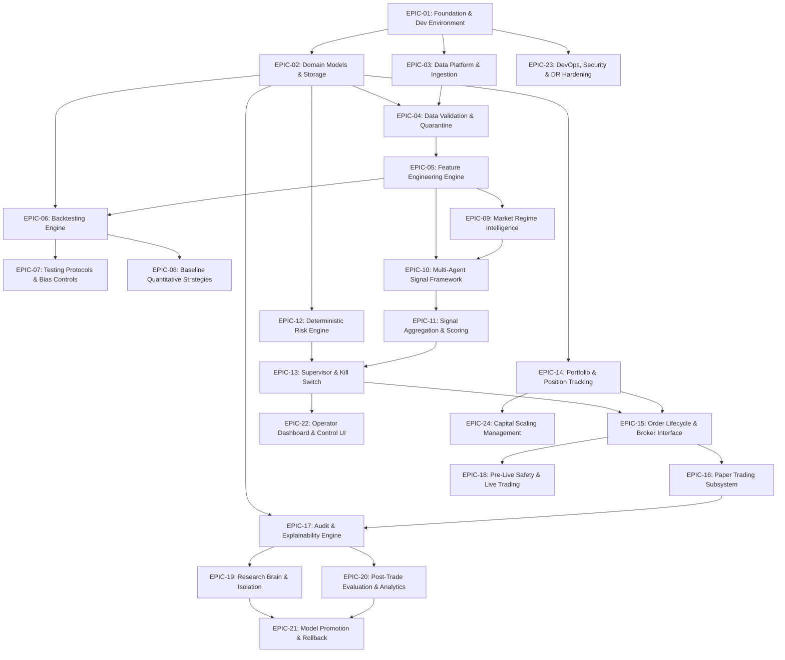
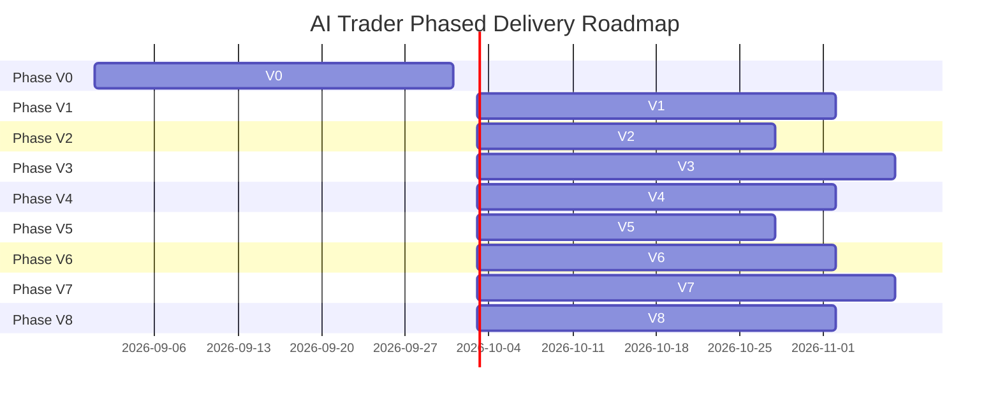

# AI Trader — Master Implementation Plan
## Autonomous Intelligent Trading System for Indian Financial Markets

| | |
|---|---|
| **Document Type** | Master Software Implementation Plan |
| **Project Identity** | AI Trader — Autonomous Intelligent Trading System |
| **Target Market** | Indian Financial Markets (NSE Equities, NIFTY Index / Derivatives Extensible) |
| **Base Currency / Capital** | INR (₹) / Initial Live Capital ₹10,000 |
| **Status** | Active Baseline v1.0 — Approved for Engineering Execution |
| **Author** | Senior Software Architect, Quantitative Systems Architect & AI/ML Architect |
| **Date** | 2026-08-29 |
| **Target Output File** | `implementation.md` |

---

## 1. Document Control

### 1.1 Revision History
| Version | Date | Author / Role | Description of Changes |
|---|---|---|---|
| **v1.0** | 2026-08-29 | Chief Architect & Multi-Agent Orchestrator | Initial comprehensive synthesis of all 51 project documents into an executable Epic-Sprint-Task implementation roadmap. |

### 1.2 Document Authority Hierarchy
This Implementation Plan strictly obeys the authoritative document hierarchy established in `AGENTS.md` §2 and Master Context §29:
$$\text{PRD} \to \text{BRD} \to \text{SOW} \to \text{FRD} \to \text{NFRD} \to \text{TRD} \to (\text{RTLD} / \text{BTD} / \text{DDD}) \to \text{HLD} \to (\text{ADD} / \text{MLD} / \text{SLD} / \text{EDD}) \to \text{TTD} \to \text{LLD} \to \text{Implementation}$$

Any discovered requirement or architectural discrepancy must be escalated to Agent 00 via an Architecture Decision Record (ADR) in `docs/decisions/` and cannot be silently resolved at the implementation layer.

---

## 2. Executive Summary

The **AI Trader** is an autonomous, intelligent trading system tailored for Indian financial markets (NSE Equities and NIFTY derivatives). It operates under a strict, non-discretionary safety framework where AI and quantitative agents generate candidate signals, while a deterministic, minimal-dependency **Risk Engine** and **Supervisor Decision Gate** hold absolute veto power over live capital.

This document translates the complete 51-document specification suite into an actionable engineering plan organized into **24 Epics**, **48 Sprints**, and **184 atomic Tasks** mapped across the **V0 through V8** delivery phases. It enforces a strict separation between the **Research Brain** (offline experimentation, model training, candidate validation) and the **Trading Brain** (deterministic live execution, real-time risk gating).

---

## 3. Source Documents Analyzed

Every Markdown (`.md`) file in the repository (51 files total) has been analyzed and indexed as the foundational source of truth:

```
├── Root Core Governance
│   ├── AGENTS.md (Master Development Orchestrator & Chief Architect Agent 00)
├── Development Agents (16 Specialist Specifications)
│   ├── agents/requirements/AGENT.md (Agent 01 - Requirements Engineering)
│   ├── agents/architecture/AGENT.md (Agent 02 - System Architecture)
│   ├── agents/quant/AGENT.md (Agent 03 - Quantitative Trading Logic)
│   ├── agents/data/AGENT.md (Agent 04 - Data Engineering)
│   ├── agents/backtesting/AGENT.md (Agent 05 - Backtesting & Simulation)
│   ├── agents/ai-architecture/AGENT.md (Agent 06 - AI / Agent Architecture)
│   ├── agents/ml/AGENT.md (Agent 07 - Machine Learning Engineering)
│   ├── agents/self-learning/AGENT.md (Agent 08 - Self-Learning & Evolution)
│   ├── agents/risk-safety/AGENT.md (Agent 09 - Risk & Safety [Veto Authority])
│   ├── agents/execution/AGENT.md (Agent 10 - Execution & Broker Integration)
│   ├── agents/technology/AGENT.md (Agent 11 - Technology & Tooling)
│   ├── agents/low-level/AGENT.md (Agent 12 - Low-Level Engineering)
│   ├── agents/security/AGENT.md (Agent 13 - Security & Secrets)
│   ├── agents/qa/AGENT.md (Agent 14 - QA & Testing)
│   ├── agents/devops/AGENT.md (Agent 15 - DevOps & SRE)
│   └── agents/code-review/AGENT.md (Agent 16 - Code Review & Verification)
├── Core Engineering Specifications (16 System Design Documents)
│   ├── docs/prd.md (Product Requirements Document v0.1)
│   ├── docs/brd.md (Business Requirements Document v0.1)
│   ├── docs/sow.md (Statement of Work v0.1)
│   ├── docs/frd.md (Functional Requirements Document v0.1)
│   ├── docs/nfrd.md (Non-Functional Requirements Document v0.1)
│   ├── docs/trd.md (Technical Requirements Document v0.1)
│   ├── docs/rtld.md (Risk & Trading Logic Design v0.1)
│   ├── docs/btd.md (Backtesting Design Document v0.1)
│   ├── docs/ddd.md (Data Design Document v0.1)
│   ├── docs/hld.md (High-Level Design v0.1)
│   ├── docs/add.md (AI / Agent Architecture Design v0.1)
│   ├── docs/mld.md (Machine Learning Design v0.1)
│   ├── docs/sld.md (Self-Learning Design v0.1)
│   ├── docs/edd.md (Execution Design Document v0.1)
│   ├── docs/ttd.md (Technology / Technical Design v0.1)
│   └── docs/lld.md (Low-Level Design v0.1 - Volume 1)
├── Architecture & Decisions
│   ├── docs/architecture/agent-dependency-map.md
│   ├── docs/architecture/subsystem-contracts.md
│   ├── docs/decisions/ADR-0000-adr-process.md
│   ├── docs/decisions/adr-0001-modular-monolith-architecture.md
│   ├── docs/decisions/adr-0002-technology-stack-python-postgres.md
│   ├── docs/decisions/adr-0003-safety-critical-isolation.md
│   ├── docs/decisions/adr-0004-rule-based-initial-agent-roster.md
│   ├── docs/decisions/OPEN_ITEMS.md (Master Open Items Register)
│   ├── docs/decisions/README.md
│   └── docs/decisions/TEMPLATE.md
├── Project Context & Traceability
│   ├── docs/project-context/document-index.md
│   ├── docs/project-context/DOCUMENT_INDEX.md
│   ├── docs/project-context/system-overview.md
│   ├── docs/project-context/traceability-matrix.md
│   ├── docs/requirements/contradiction-and-open-items-register.md
│   ├── docs/requirements/requirements-analysis.md
│   └── docs/requirements/TRACEABILITY_MATRIX.md
└── Quality & Review
    └── docs/reviews/review-checklists.md
```

---

## 4. Implementation Principles

1. **Safety First & Deterministic Independence (BRD BR-1, BR-4, FRD-RISK-11, NFR-SAFE-1)**: Hard risk limits execute on an isolated, zero-dependency code path. No AI, LLM, or probabilistic model may override or loosen a safety check.
2. **Research Brain vs. Trading Brain Strict Separation (TRD-ARCH-2, FRD-X-4, NFR-SAFE-5)**: Research environments have zero network routes, credentials, or code paths to execute live orders or modify live risk configurations.
3. **NO TRADE Is a First-Class Decision (BRD BR-3, PRD FR-8, FRD-AGG-4)**: The system must never be incentivized or tuned to force low-quality trades.
4. **Capital Preservation Over Return (BRD BR-1, PRD §9)**:
   $$\text{NO TRADE} > \text{Low-Quality Trade} > \text{Small Loss} > \text{Catastrophic Loss}$$
5. **No Fake Intelligence (Master Context §4.5, ADD §4)**: Simple rule-based and statistical methods are the default. Heavier ML/RL models are introduced only when statistical outperformance is demonstrated.
6. **No Silent Capital Scaling (BRD BR-2, FRD-CAP-2)**: Live trading starts at ₹10,000. Capital scales only via predefined statistical criteria requiring explicit operator authorization.
7. **100% Auditability & Immutability (BRD BR-7, FRD-EVAL-1, NFR-DATA-4)**: Every decision (including NO TRADE and HOLD) generates an immutable, strongly-typed `DecisionRecord`.

---

## 5. System Implementation Scope

```mermaid
graph TB
    subgraph MarketDataLayer [Market Data & Ingestion]
        MD1[REST / WebSocket Ingestion] --> MD2[Data Validation & Quarantine]
        MD2 --> MD3[(PostgreSQL / TimescaleDB)]
        MD2 --> MD4[(Parquet Historical Archive)]
    end

    subgraph FeatureAndRegime [Intelligence Preparation]
        MD3 --> FE[Feature Engine]
        FE --> RD[Market Regime Detector]
    end

    subgraph AgentRoster [Multi-Agent Intelligence Roster]
        FE --> AG1[Trend Agent]
        FE --> AG2[Momentum Agent]
        FE --> AG3[Mean-Reversion Agent]
        FE --> AG4[Price Action Agent]
        RD -.-> AG1
        RD -.-> AG2
        RD -.-> AG3
        RD -.-> AG4
    end

    subgraph AggregationLayer [Signal Aggregation]
        AG1 --> AGG[Signal Aggregator]
        AG2 --> AGG
        AG3 --> AGG
        AG4 --> AGG
        AGG --> DTI[Dynamic Timeframe Selector]
    end

    subgraph SafetyIsolation [Safety-Critical Boundary (Minimal Dependencies)]
        DTI --> RE[Deterministic Risk Engine]
        RE --> SUP[Supervisor Decision Gate]
        KS[Emergency Kill Switch] --> SUP
        STOP[Manual STOP Button] --> KS
    end

    subgraph ExecutionLayer [Execution & Reconciliation]
        SUP -->|Approved BUY/SELL| EE[Execution Engine]
        EE --> BA[Broker Adapter]
        BA --> BRK[Indian Broker API]
    end

    subgraph ObservabilityLayer [Audit & Self-Learning]
        SUP -->|All Decisions| EVAL[Evaluation & Audit Service]
        EE -->|Fills & Rejections| EVAL
        EVAL --> DR[(Immutable Decision Records)]
        DR --> RES[Research Brain / Learning Pipeline]
        RES -->|Validated Models| REG[(Model Registry)]
        REG -->|Operator Gated| FE
    end
```

---

## 6. Architecture Implementation Overview

The system is implemented as a **Modular Monolith for the Trading Brain** (ADR-0001) alongside a **strictly isolated Research Brain** deployable unit:

- **Trading Brain**: Python 3.12+ process running continuously during market hours. Encapsulates Data Pipeline, Feature Engine, Regime Detector, Agent Roster, Aggregator, Risk Engine, Supervisor, Execution Engine, and Evaluation Service.
- **Safety-Critical Path**: `RiskEngine`, `Supervisor`, and `KillSwitch` implemented with zero runtime dependencies on AI models, external LLMs, or network event buses (ADR-0003).
- **Storage**: PostgreSQL 16+ with TimescaleDB for ACID transactional state, positions, orders, and real-time hypertables; partitioned Parquet files for bulk historical data.
- **Inter-Module Communication**: Strongly-typed direct function calls and Python `Protocol` interfaces (`subsystem-contracts.md`). Zero asynchronous event-bus complexity for the safety path.

---

## 7. Master Dependency Graph



---

## 8. Implementation Phases (V0–V8)



### Phase V0 — Research Foundation
- **Focus**: Data ingestion pipelines, data validation, PostgreSQL/TimescaleDB setup, Parquet historical store, exploratory analytics.
- **Capital at Risk**: ₹0.
- **Exit Gate G0**: Verified ingestion of multi-year NSE OHLCV data with automated gap/anomaly quarantine.

### Phase V1 — Backtesting Foundation
- **Focus**: Realistic cost engine (brokerage, STT, exchange charges, stamp duty, GST, slippage), fill simulation, known-answer bias tests.
- **Capital at Risk**: ₹0.
- **Exit Gate G1**: 100% pass on synthetic known-answer backtesting suites with zero look-ahead leakage.

### Phase V2 — ML Foundation
- **Focus**: Modular Feature Engine, point-in-time calculation guarantees, predictive model baseline, evaluation metrics framework.
- **Capital at Risk**: ₹0.
- **Exit Gate G2**: Feature set versioning active; out-of-sample evaluation framework operational.

### Phase V3 — Multi-Agent Decision System
- **Focus**: Regime Detector (5 dimensions), 4-agent roster (Trend, Momentum, Mean-Reversion, Price Action), Aggregator, Deterministic Risk Engine, Supervisor Decision Gate, Kill Switch.
- **Capital at Risk**: ₹0 (Simulated environment).
- **Exit Gate G3**: 100% branch coverage on Risk Engine and Supervisor; kill switch $<2$s response verified; simulated decision pipeline operational.

### Phase V4 — Paper Trading
- **Focus**: Real-time market data streaming, simulated order lifecycle, position tracking, continuous market-hours operation.
- **Capital at Risk**: ₹0 (Real-time simulated execution).
- **Exit Gate G4**: 30 consecutive trading days of unattended paper trading with zero unhandled disconnections or duplicate orders.

### Phase V5 — Risk-Controlled Live Trading
- **Focus**: Broker API integration, SOW §9 regulatory/compliance sign-off, live ₹10,000 deployment, startup reconciliation, manual STOP UI.
- **Capital at Risk**: ₹10,000 initial experimental capital.
- **Exit Gate G5**: Live trading operational with zero hard risk limit breaches and 100% immutable decision audit logging.

### Phase V6 — Self-Learning Foundation
- **Focus**: Post-trade evaluation pipeline, variance driver classification, isolated Research Brain candidate generation.
- **Capital at Risk**: ₹10,000 (Live trading unchanged).
- **Exit Gate G6**: Structured `TradeEvaluation` records generated for 100% of closed trades; Research Brain proven isolated from order routing.

### Phase V7 — Adaptive Autonomous Trader
- **Focus**: Multi-stage model promotion pipeline (backtest $\to$ OOS $\to$ walk-forward $\to$ stress $\to$ robustness $\to$ paper), automated rollback, dynamic timeframe selection.
- **Capital at Risk**: ₹10,000.
- **Exit Gate G7**: Automated promotion gate rejects sub-threshold models; deliberately degraded model triggers automated rollback.

### Phase V8 — Scalable Production System
- **Focus**: Production observability hardening, capital scaling automation per RTLD §15 criteria, high-reliability operations.
- **Capital at Risk**: ₹10,000 scaling to ₹12,500+ only upon operator authorization.
- **Exit Gate G8**: Full operational runbook validated; multi-regime statistical profitability demonstrated; capital scaling controls verified.

---

## 9. Epic Register

| Epic ID | Epic Name | Delivery Phase | Primary Subsystem / Module |
|---|---|---|---|
| **EPIC-01** | Project Foundation & Engineering Environment | Phase V0 | Project Infrastructure & Tooling |
| **EPIC-02** | Domain Entities & Hybrid Storage Architecture | Phase V0 | Data Architecture & Schemas (DDD) |
| **EPIC-03** | Market Data Ingestion & Storage Pipelines | Phase V0 | Module 1: Data Ingestion & Validation |
| **EPIC-04** | Data Quality, Validation & Quarantine Framework | Phase V0 | Module 1: Data Ingestion & Validation |
| **EPIC-05** | Point-in-Time Feature Engineering Engine | Phase V1 / V2 | Module 2: Feature Engineering |
| **EPIC-06** | Realistic Backtesting & Indian Market Cost Engine | Phase V1 | Backtesting Subsystem (BTD) |
| **EPIC-07** | Bias Guardrails & Multi-Stage Testing Protocols | Phase V1 | Backtesting & QA Subsystems (BTD) |
| **EPIC-08** | Baseline Quantitative Trading Strategies | Phase V1 | Quantitative Strategy Subsystem |
| **EPIC-09** | Market Regime Intelligence Subsystem | Phase V3 | Module 3: Market Regime Detection |
| **EPIC-10** | Multi-Agent Signal Generation Roster | Phase V3 | Module 4: Signal Generation |
| **EPIC-11** | Signal Aggregation & Dynamic Timeframe Selection | Phase V3 | Module 5: Signal Aggregation & Scoring |
| **EPIC-12** | Deterministic Risk Engine & Safety Isolation | Phase V3 | Module 6: Risk Engine |
| **EPIC-13** | Supervisor Decision Gate & Emergency Kill Switch | Phase V3 | Module 7 & 11: Supervisor & Kill Switch |
| **EPIC-14** | Portfolio Ledger & Position State Tracking | Phase V3 / V4 | Portfolio Management Subsystem |
| **EPIC-15** | Order Lifecycle & Broker Integration Layer | Phase V4 / V5 | Module 8: Execution Engine |
| **EPIC-16** | Real-Time Paper Trading Subsystem | Phase V4 | Execution & Simulation Subsystems |
| **EPIC-17** | Decision Audit & Trade Evaluation Engine | Phase V4 / V5 | Module 9: Trade Evaluation & Explainability |
| **EPIC-18** | Live Trading Activation & Safety Preconditions | Phase V5 | Module 8: Execution Engine |
| **EPIC-19** | Research Brain Infrastructure & Sandboxing | Phase V6 | Module 10: Learning & Model Lifecycle |
| **EPIC-20** | Post-Trade Analytics & Variance Classification | Phase V6 | Module 9 & 10: Learning Pipeline |
| **EPIC-21** | Model Promotion Pipeline & Automated Rollback | Phase V7 | Module 10: Learning & Model Lifecycle |
| **EPIC-22** | Operator Dashboard & Health Monitoring | Phase V4 / V8 | Module 11: Dashboard & Human Control |
| **EPIC-23** | DevOps, Security, Secrets & Disaster Recovery | Phase V0 / V8 | DevOps & Security Subsystems |
| **EPIC-24** | Capital Scaling & Multi-Criteria Governance | Phase V8 | Module 12: Capital & Growth Management |

---

## 10. Sprint Register

| Sprint ID | Epic | Sprint Name | Target Phase |
|---|---|---|---|
| **S01.01** | EPIC-01 | Repository Setup, Tooling & Quality Toolchain | Phase V0 |
| **S01.02** | EPIC-01 | Environment & Centralized Configuration Framework | Phase V0 |
| **S02.01** | EPIC-02 | Canonical Pydantic v2 Domain Models | Phase V0 |
| **S02.02** | EPIC-02 | PostgreSQL / TimescaleDB DDL & Parquet Archive | Phase V0 |
| **S03.01** | EPIC-03 | Market Data Adapter Interface & Historical Ingestion | Phase V0 |
| **S03.02** | EPIC-03 | Real-Time WebSocket Streaming Pipeline | Phase V0 |
| **S04.01** | EPIC-04 | Data Validation Rules & Physical Sanity Checks | Phase V0 |
| **S04.02** | EPIC-04 | Staleness Detection, Quarantine & Suppression Gate | Phase V0 |
| **S05.01** | EPIC-05 | Technical Indicator & Price Action Feature Engine | Phase V1 / V2 |
| **S05.02** | EPIC-05 | Point-in-Time Calculation Guarantees & Versioning | Phase V1 / V2 |
| **S06.01** | EPIC-06 | Indian Statutory Charges & Brokerage Cost Model | Phase V1 |
| **S06.02** | EPIC-06 | Order Fill Simulation & Next-Bar Execution Engine | Phase V1 |
| **S07.01** | EPIC-07 | Out-of-Sample Split & Walk-Forward Protocol | Phase V1 |
| **S07.02** | EPIC-07 | Stress Testing & Monte Carlo Resampling Engine | Phase V1 |
| **S08.01** | EPIC-08 | Rule-Based Momentum & Trend Baseline Strategies | Phase V1 |
| **S08.02** | EPIC-08 | Mean-Reversion Baseline Strategy & Reporting | Phase V1 |
| **S09.01** | EPIC-09 | Multi-Dimensional Regime Classification Engine | Phase V3 |
| **S09.02** | EPIC-09 | Regime Transition Detection & Hysteresis Filtering | Phase V3 |
| **S10.01** | EPIC-10 | Trading Agent Interface & Normalized Output Contract | Phase V3 |
| **S10.02** | EPIC-10 | Rule-Based Agent Roster Implementation | Phase V3 |
| **S11.01** | EPIC-11 | Weighted Signal Aggregator & Score Normalization | Phase V3 |
| **S11.02** | EPIC-11 | Dynamic Timeframe Intelligence & Disagreement Metric | Phase V3 |
| **S12.01** | EPIC-12 | Deterministic Risk Engine Core & Parameter Register | Phase V3 |
| **S12.02** | EPIC-12 | Sizing Engine & Consecutive Loss Circuit Breakers | Phase V3 |
| **S13.01** | EPIC-13 | Supervisor Decision Gate & Precedence Logic | Phase V3 |
| **S13.02** | EPIC-13 | Emergency Kill Switch & Manual STOP Subsystem | Phase V3 |
| **S14.01** | EPIC-14 | Transactional Position Ledger & Portfolio Tracking | Phase V3 / V4 |
| **S15.01** | EPIC-15 | Broker Adapter Interface & Idempotency Engine | Phase V4 / V5 |
| **S15.02** | EPIC-15 | Order Lifecycle State Machine & Reconnection Logic | Phase V4 / V5 |
| **S16.01** | EPIC-16 | Simulated Paper Broker Adapter | Phase V4 |
| **S16.02** | EPIC-16 | Continuous Paper Trading Market-Hours Harness | Phase V4 |
| **S17.01** | EPIC-17 | Immutable Decision Record Audit Logging | Phase V4 / V5 |
| **S17.02** | EPIC-17 | Post-Trade Evaluation & Operator Query Interface | Phase V4 / V5 |
| **S18.01** | EPIC-18 | Pre-Live SOW §9 Precondition Audit & Credential Setup | Phase V5 |
| **S18.02** | EPIC-18 | Live Trading Activation & Startup Reconciliation Gate | Phase V5 |
| **S19.01** | EPIC-19 | Research Brain Physical Isolation & Sandboxing | Phase V6 |
| **S19.02** | EPIC-19 | RL Sandboxed Training Environment (Optional) | Phase V6 |
| **S20.01** | EPIC-20 | Multi-Trade Variance Driver Pattern Extraction | Phase V6 |
| **S20.02** | EPIC-20 | Scoped Hypothesis & Candidate Generation Workflow | Phase V6 |
| **S21.01** | EPIC-21 | Multi-Stage Model Validation Pipeline Runner | Phase V7 |
| **S21.02** | EPIC-21 | Model Promotion Gate & Automated Rollback Monitor | Phase V7 |
| **S22.01** | EPIC-22 | FastAPI Control Backend & `/health` Endpoint | Phase V4 / V8 |
| **S22.02** | EPIC-22 | Operator Web Dashboard & Manual STOP UI | Phase V4 / V8 |
| **S23.01** | EPIC-23 | Secrets Management, TLS Enforcement & Pre-commit Audit | Phase V0 / V8 |
| **S23.02** | EPIC-23 | Docker Topology, Process Supervision & Disaster Recovery | Phase V0 / V8 |
| **S24.01** | EPIC-24 | Capital Scaling Evaluation Engine (RTLD §15) | Phase V8 |
| **S24.02** | EPIC-24 | Operator Authorization Flow & Withdrawal Accounting | Phase V8 |

---

## 11. Detailed Epic & Task Plans

### EPIC-01: Project Foundation & Engineering Environment
- **Objective**: Establish the Python 3.12+ development foundation, strict typing, linting, testing, and configuration management infrastructure.
- **Governing Docs**: TRD §4, §14; TTD §4, §12, §14; `AGENTS.md` §8.

#### Sprint S01.01 — Repository Setup, Tooling & Quality Toolchain
- **Objective**: Configure the repository build system, dependency locking, and pre-commit code quality enforcement.

##### TASK-01-01-001: Initialize Python 3.12+ Environment and Dependency Management
- **Task ID**: `TASK-01-01-001`
- **Task Name**: Setup `uv` / `poetry` build configuration and package manifests
- **Description**: Configure `pyproject.toml` with Python 3.12+ constraints, install dev toolchain (`ruff`, `mypy`, `pytest`, `structlog`, `pydantic`), and generate deterministic lockfile.
- **Purpose**: Ensure reproducible builds and consistent virtual environments across developer machines and CI.
- **Source Requirements**: TRD §3, §14; TTD §4, §12; NFR-MAINT-1.
- **Source Documents**: `docs/trd.md`, `docs/ttd.md`.
- **Dependencies**: None.
- **Inputs**: Python 3.12 runtime.
- **Outputs**: `pyproject.toml`, `uv.lock` or `poetry.lock`.
- **Implementation Notes**: Enforce strict dependency pinning; separate production dependencies from research/test dependencies.
- **Files/Modules Expected to Change**: `pyproject.toml`, `.gitignore`, `README.md`.
- **Acceptance Criteria**: Virtual environment installs cleanly; all core tools executable via CLI.
- **Testing Requirements**: Run dependency tree resolution and package import tests.
- **Definition of Done**: Lockfile committed; CI environment installs without warnings.

##### TASK-01-01-002: Configure Static Analysis, Code Formatting, and Type Checking
- **Task ID**: `TASK-01-01-002`
- **Task Name**: Configure Ruff, Mypy Strict Mode, and Pre-commit Hooks
- **Description**: Configure `ruff` for linting/formatting and `mypy` in strict mode (`disallow_untyped_defs = true`). Add `.pre-commit-config.yaml` with secret detection (`gitleaks`/`detect-secrets`).
- **Purpose**: Prevent code quality degradation and hardcoded secrets from entering source control.
- **Source Requirements**: TRD-SEC-1; NFR-SEC-1; NFR-MAINT-1; `AGENTS.md` §8.
- **Source Documents**: `docs/trd.md`, `docs/nfrd.md`.
- **Dependencies**: `TASK-01-01-001`.
- **Inputs**: Package configuration.
- **Outputs**: `ruff.toml`, `mypy.ini`, `.pre-commit-config.yaml`.
- **Implementation Notes**: Block commits containing raw API keys, tokens, or untyped function definitions.
- **Files/Modules Expected to Change**: `.pre-commit-config.yaml`, `pyproject.toml`.
- **Acceptance Criteria**: Pre-commit hooks run locally and pass; `mypy --strict` passes on empty base package.
- **Testing Requirements**: Test pre-commit hook triggers on dummy secret and dummy untyped function.
- **Definition of Done**: Hooks execute automatically on `git commit`.

##### TASK-01-01-003: Configure Pytest Framework and CI Workflow
- **Task ID**: `TASK-01-01-003`
- **Task Name**: Setup Pytest Test Harness and GitHub Actions CI Pipeline
- **Description**: Create `tests/` directory structure mirroring components (`tests/unit/`, `tests/integration/`, `tests/safety/`). Configure GitHub Actions CI workflow to run lint, typecheck, tests, and branch coverage.
- **Purpose**: Establish automated testing and continuous integration gates before any application logic is written.
- **Source Requirements**: TRD-CI-1, TRD-CI-2; NFR-TEST-1, NFR-TEST-3; NFR-SAFE-6.
- **Source Documents**: `docs/trd.md`, `docs/nfrd.md`.
- **Dependencies**: `TASK-01-01-002`.
- **Inputs**: Tooling configuration.
- **Outputs**: `.github/workflows/ci.yml`, `tests/conftest.py`.
- **Implementation Notes**: Configure `pytest-cov` with failure threshold if safety-critical modules fail 100% branch coverage.
- **Files/Modules Expected to Change**: `.github/workflows/ci.yml`, `tests/conftest.py`.
- **Acceptance Criteria**: GitHub Actions pipeline runs on push/PR and executes linting, typing, and test suites.
- **Testing Requirements**: Verify pipeline succeeds on baseline dummy test and fails on introduced lint/type defect.
- **Definition of Done**: CI status badge green; PR branch protection configured.

#### Sprint S01.02 — Environment & Centralized Configuration Framework
- **Objective**: Implement environment-aware, versioned, immutable configuration loading.

##### TASK-01-02-001: Implement Structured Logging Framework
- **Task ID**: `TASK-01-02-001`
- **Task Name**: Implement Structlog JSON Structured Logging Engine
- **Description**: Implement `src/utils/logging.py` using `structlog` to emit machine-parseable JSON logs containing timestamp (UTC), module, level, correlation ID, and contextual payload.
- **Purpose**: Satisfy NFR-AUDIT-1/3 and TRD-OBS-1 for unified observability.
- **Source Requirements**: TRD-OBS-1; NFR-AUDIT-1, NFR-AUDIT-3.
- **Source Documents**: `docs/trd.md`, `docs/nfrd.md`, `docs/ttd.md` §13.
- **Dependencies**: `TASK-01-01-001`.
- **Inputs**: Logging configuration settings.
- **Outputs**: `src/utils/logging.py`, `tests/unit/test_logging.py`.
- **Implementation Notes**: Support pretty-printing for local development and JSON output in CI/production.
- **Files/Modules Expected to Change**: `src/utils/logging.py`.
- **Acceptance Criteria**: Log output parseable as valid JSON; contextual dictionary fields correctly serialized.
- **Testing Requirements**: Unit tests verifying JSON formatting and field presence.
- **Definition of Done**: Logger imported and verified in baseline tests.

##### TASK-01-02-002: Implement Environment-Aware Configuration Loader
- **Task ID**: `TASK-01-02-002`
- **Task Name**: Implement Pydantic Settings Configuration Engine
- **Description**: Implement `src/config/settings.py` using `pydantic-settings`. Load environment-specific `.env` files (`.env.research`, `.env.paper`, `.env.live`) with strict validation.
- **Purpose**: Enforce TRD-DEPLOY-2 (no shared config between paper and live) and NFR-MAINT-3.
- **Source Requirements**: TRD-DEPLOY-2; NFR-MAINT-3; TTD §12.
- **Source Documents**: `docs/trd.md`, `docs/ttd.md`, `docs/nfrd.md`.
- **Dependencies**: `TASK-01-01-001`.
- **Inputs**: System environment variables, `.env` files.
- **Outputs**: `src/config/settings.py`, `src/config/models.py`.
- **Implementation Notes**: Fail immediately on startup if mandatory variables (e.g., database URL, environment tag) are missing.
- **Files/Modules Expected to Change**: `src/config/settings.py`.
- **Acceptance Criteria**: Configuration loads cleanly; missing required environment variables raise descriptive validation errors.
- **Testing Requirements**: Unit tests for default values, overrides, and missing variable failure.
- **Definition of Done**: 100% test coverage on configuration loader.

---

### EPIC-02: Domain Entities & Hybrid Storage Architecture
- **Objective**: Implement canonical Pydantic domain models, PostgreSQL 16+ / TimescaleDB schema migrations, and Parquet historical archive storage.
- **Governing Docs**: DDD v0.1; TRD §6; TTD §6; HLD §6, §15.

#### Sprint S02.01 — Canonical Pydantic v2 Domain Models
- **Objective**: Implement immutable domain entities for market data, decisions, evaluations, orders, and model governance.

##### TASK-02-01-001: Implement Core Market Data and Feature Domain Models
- **Task ID**: `TASK-02-01-001`
- **Task Name**: Implement `OHLCVCandle`, `MarketDepthQuote`, `CorporateAction`, and `FeatureSet` Models
- **Description**: Implement typed Pydantic models in `src/domain/market_data.py` and `src/domain/features.py` with strict numeric constraints (`open > 0`, `volume >= 0`, UTC timestamps).
- **Purpose**: Provide the single contract for all market data ingestion and feature computation (DDD §4, §5.1).
- **Source Requirements**: FRD-DATA-1, FRD-DATA-5; FRD-FEAT-3; DDD §4, §5.1; TRD-PIPE-3.
- **Source Documents**: `docs/ddd.md`, `docs/frd.md`.
- **Dependencies**: `TASK-01-02-002`.
- **Inputs**: Raw price/feature dictionaries.
- **Outputs**: `src/domain/market_data.py`, `src/domain/features.py`.
- **Implementation Notes**: Use `Decimal` for financial prices and turnovers to prevent floating point inaccuracies.
- **Files/Modules Expected to Change**: `src/domain/market_data.py`, `src/domain/features.py`.
- **Acceptance Criteria**: Models validate compliant data and reject negative prices or invalid timestamps.
- **Testing Requirements**: Unit tests testing boundary validations (zero volume, negative price, leap years).
- **Definition of Done**: 100% type annotations; unit tests passing.

##### TASK-02-01-002: Implement Master DecisionRecord and TradeEvaluation Domain Models
- **Task ID**: `TASK-02-01-002`
- **Task Name**: Implement `DecisionRecord` and `TradeEvaluation` Entity Models
- **Description**: Implement `src/domain/decision.py` and `src/domain/evaluation.py` implementing the complete audit schema from DDD §5.2 and §5.3.
- **Purpose**: Standardize the immutable decision record structure across all Trading Brain and Research Brain components.
- **Source Requirements**: FRD-EVAL-1, FRD-EVAL-3; TRD-ARCH-4; DDD §5.2, §5.3; BRD BR-7.
- **Source Documents**: `docs/ddd.md`, `docs/frd.md`, `docs/brd.md`.
- **Dependencies**: `TASK-02-01-001`.
- **Inputs**: Decision metadata, agent outputs, risk check outcomes.
- **Outputs**: `src/domain/decision.py`, `src/domain/evaluation.py`.
- **Implementation Notes**: Distinguish clearly between raw model inputs, calculated features, and decision rationale (FRD-EVAL-2).
- **Files/Modules Expected to Change**: `src/domain/decision.py`, `src/domain/evaluation.py`.
- **Acceptance Criteria**: Schema validates full audit trail; JSON serialization preserves decimal precision.
- **Testing Requirements**: Serialization and deserialization round-trip unit tests.
- **Definition of Done**: Unit tests passing; entities exported in domain package.

##### TASK-02-01-003: Implement Position, Order, and Model Governance Domain Models
- **Task ID**: `TASK-02-01-003`
- **Task Name**: Implement `OrderSubmission`, `Position`, `ModelVersion`, `ValidationRunRecord`, and `PromotionEvent`
- **Description**: Implement domain models in `src/domain/execution.py` and `src/domain/governance.py` per DDD §5.4 and §5.5.
- **Purpose**: Establish type contracts for order execution state and model promotion gating.
- **Source Requirements**: FRD-EXEC-3, FRD-EXEC-4; FRD-LEARN-6, FRD-LEARN-8; DDD §5.4, §5.5.
- **Source Documents**: `docs/ddd.md`, `docs/frd.md`.
- **Dependencies**: `TASK-02-01-001`.
- **Inputs**: Order states and model validation metrics.
- **Outputs**: `src/domain/execution.py`, `src/domain/governance.py`.
- **Implementation Notes**: Include Git commit hash and artifact SHA256 checksums in `ModelVersion`.
- **Files/Modules Expected to Change**: `src/domain/execution.py`, `src/domain/governance.py`.
- **Acceptance Criteria**: Validates all lifecycle states (`PENDING`, `SUBMITTED`, `FILLED`, `candidate`, `promoted`, `rolled_back`).
- **Testing Requirements**: State transition validation unit tests.
- **Definition of Done**: Entities exported and documented.

#### Sprint S02.02 — PostgreSQL / TimescaleDB DDL & Parquet Archive
- **Objective**: Create database schema, TimescaleDB hypertables, migrations, and Parquet columnar storage repository.

##### TASK-02-02-001: Setup PostgreSQL / TimescaleDB Database and Alembic Migrations
- **Task ID**: `TASK-02-02-001`
- **Task Name**: Create PostgreSQL Schema DDL and Alembic Migration Pipeline
- **Description**: Setup SQLAlchemy 2.0 / Alembic migration scripts creating tables for `ohlcv_candles` (hypertable), `decision_records`, `trade_evaluations`, `model_versions`, `validation_runs`, `order_submissions`, and `positions` (DDD §6).
- **Purpose**: Provide transactional ACID persistence for live state and time-series hypertables for real-time market data.
- **Source Requirements**: TRD-DATA-1, TRD-DATA-2, TRD-DATA-3; DDD §6; TTD §6.
- **Source Documents**: `docs/ddd.md`, `docs/trd.md`, `docs/ttd.md`.
- **Dependencies**: `TASK-02-01-002`, `TASK-02-01-003`.
- **Inputs**: PostgreSQL database connection.
- **Outputs**: `alembic/`, `src/infrastructure/database.py`, `src/infrastructure/models.py`.
- **Implementation Notes**: Enforce `INSERT`-only permissions on `decision_records` and `trade_evaluations`.
- **Files/Modules Expected to Change**: `alembic/versions/*`, `src/infrastructure/database.py`.
- **Acceptance Criteria**: Migrations upgrade and downgrade cleanly; hypertable partitions correctly on `timestamp`.
- **Testing Requirements**: Integration test executing migrations against local test PostgreSQL container.
- **Definition of Done**: Migration test passing in CI pipeline with testcontainers.

##### TASK-02-02-002: Implement Partitioned Parquet Storage Manager
- **Task ID**: `TASK-02-02-002`
- **Task Name**: Implement Parquet Historical Archive Reader and Writer
- **Description**: Implement `src/infrastructure/parquet_store.py` using `pyarrow` / `fastparquet`. Partition time-series data by `instrument` and `year/month` for fast columnar scans during backtesting.
- **Purpose**: Satisfy TRD-DATA-1 and BTD §5 for high-throughput historical data querying without overloading PostgreSQL.
- **Source Requirements**: TRD-DATA-1, TRD-DATA-4; BTD §5; TTD §6.
- **Source Documents**: `docs/btd.md`, `docs/trd.md`, `docs/ttd.md`.
- **Dependencies**: `TASK-02-01-001`.
- **Inputs**: List or DataFrame of `OHLCVCandle`s.
- **Outputs**: `src/infrastructure/parquet_store.py`, `tests/integration/test_parquet_store.py`.
- **Implementation Notes**: Implement point-in-time range filters that guarantee no data past query timestamp is returned.
- **Files/Modules Expected to Change**: `src/infrastructure/parquet_store.py`.
- **Acceptance Criteria**: Writing 100,000 candles and reading arbitrary date slices executes in $<50$ms.
- **Testing Requirements**: Read/write round-trip test; boundary date range tests.
- **Definition of Done**: Unit and integration tests passing.

---

### EPIC-03: Market Data Ingestion & Storage Pipelines
- **Objective**: Implement pluggable market data adapters, bulk historical ingestion, and real-time streaming interfaces.
- **Governing Docs**: FRD Module 1; TRD §7; HLD §9; `subsystem-contracts.md` §1.

#### Sprint S03.01 — Market Data Adapter Interface & Historical Ingestion
- **Objective**: Implement `DataSourceAdapter` Protocol and historical market data ingestors.

##### TASK-03-01-001: Implement DataSourceAdapter Protocol and Factory
- **Task ID**: `TASK-03-01-001`
- **Task Name**: Implement `DataSourceAdapter` Interface Contract
- **Description**: Implement `src/data/adapter.py` defining the typed Python `Protocol` for data providers per `docs/architecture/subsystem-contracts.md` §1.
- **Purpose**: Decouple market data ingestion from specific vendors (TRD-PIPE-1, HLD §9).
- **Source Requirements**: FRD-DATA-8; TRD-PIPE-1; HLD §9; `subsystem-contracts.md` §1.
- **Source Documents**: `docs/architecture/subsystem-contracts.md`, `docs/hld.md`, `docs/frd.md`.
- **Dependencies**: `TASK-02-01-001`.
- **Inputs**: Instrument symbol, timeframe, date range.
- **Outputs**: `src/data/adapter.py`.
- **Implementation Notes**: Include methods for `connect`, `disconnect`, `subscribe_candles`, `subscribe_depth`, and `fetch_historical_candles`.
- **Files/Modules Expected to Change**: `src/data/adapter.py`.
- **Acceptance Criteria**: Abstract protocol passes type-checking; mock adapter can be implemented cleanly.
- **Testing Requirements**: Type-conformance tests with Mypy.
- **Definition of Done**: Interface exported and documented.

##### TASK-03-01-002: Implement Historical CSV / Public Data Ingestion Adapter
- **Task ID**: `TASK-03-01-002`
- **Task Name**: Implement Yahoo Finance / NSE Historical Data Loader
- **Description**: Implement `src/data/historical_loader.py` to ingest historical daily and intraday OHLCV data for NSE equities and NIFTY indices into Parquet and TimescaleDB.
- **Purpose**: Enable Phase 0 research and historical backtesting without requiring paid vendor feeds.
- **Source Requirements**: FRD-DATA-1, FRD-DATA-5; SOW §6.1 (V0); TRD-PIPE-3.
- **Source Documents**: `docs/frd.md`, `docs/sow.md`, `docs/trd.md`.
- **Dependencies**: `TASK-03-01-001`, `TASK-02-02-002`.
- **Inputs**: NSE symbols (`NSE:RELIANCE`, `NSE:NIFTY50`), date range.
- **Outputs**: `src/data/historical_loader.py`, CLI script `scripts/ingest_historical.py`.
- **Implementation Notes**: Normalize timezone to UTC; attach temporal context (day of week, session).
- **Files/Modules Expected to Change**: `src/data/historical_loader.py`, `scripts/ingest_historical.py`.
- **Acceptance Criteria**: Successfully ingests 5 years of historical NIFTY/NSE daily data into Parquet storage.
- **Testing Requirements**: Integration test verifying data row count, columns, and timestamp ordering.
- **Definition of Done**: Script tested and documented in README.

#### Sprint S03.02 — Real-Time WebSocket Streaming Pipeline
- **Objective**: Implement asynchronous streaming candle and market depth ingestion.

##### TASK-03-02-001: Implement Streaming WebSocket Feed Ingestion Pipeline
- **Task ID**: `TASK-03-02-001`
- **Task Name**: Implement Real-time Streaming Candle and Depth Ingestor
- **Description**: Implement `src/data/streaming.py` managing asynchronous WebSocket connections, message parsing, heartbeat monitoring, and candle aggregation.
- **Purpose**: Stream real-time market data into the Trading Brain for paper (V4) and live (V5) trading.
- **Source Requirements**: FRD-DATA-1; TRD-PIPE-3; NFR-REL-4.
- **Source Documents**: `docs/frd.md`, `docs/trd.md`, `docs/nfrd.md`.
- **Dependencies**: `TASK-03-01-001`, `TASK-02-02-001`.
- **Inputs**: WebSocket tick stream.
- **Outputs**: `src/data/streaming.py`, `src/data/feed_handler.py`.
- **Implementation Notes**: Buffer ticks and aggregate into closed 1-minute and 5-minute candles; emit `OHLCVCandle` objects.
- **Files/Modules Expected to Change**: `src/data/streaming.py`.
- **Acceptance Criteria**: Feed handler aggregates synthetic tick stream into exact OHLCV candles without dropping ticks.
- **Testing Requirements**: Async unit tests with mock WebSocket server simulating market ticks.
- **Definition of Done**: 100% test pass on tick-to-candle aggregation.

---

### EPIC-04: Data Quality, Validation & Quarantine Framework
- **Objective**: Implement physical price sanity checks, gap detection, staleness monitoring, and quarantine suppression.
- **Governing Docs**: FRD Module 1 (FRD-DATA-6, 7, 9); DDD §7; NFR-DATA-1, 2; HLD §7.

#### Sprint S04.01 — Data Validation Rules & Physical Sanity Checks
- **Objective**: Implement deterministic candle validation and physical price constraint rules.

##### TASK-04-01-001: Implement Physical Price and Volume Sanity Validator
- **Task ID**: `TASK-04-01-001`
- **Task Name**: Implement `DataValidationPipeline` Physical Validation Rules
- **Description**: Implement `src/data/validator.py` executing deterministic sanity checks on incoming `OHLCVCandle`s per DDD §7:
  1. $Low \le Open \le High$ and $Low \le Close \le High$
  2. $Volume \ge 0$ and $Turnover \ge 0$
  3. Single-bar extreme price jump check ($>20\%$ threshold on cash equities)
- **Purpose**: Prevent corrupt or bad-tick vendor data from entering the feature engine or decision loop (FRD-DATA-6).
- **Source Requirements**: FRD-DATA-6, FRD-DATA-7; DDD §7; NFR-DATA-2.
- **Source Documents**: `docs/ddd.md`, `docs/frd.md`, `docs/nfrd.md`.
- **Dependencies**: `TASK-02-01-001`.
- **Inputs**: Current `OHLCVCandle`, prior candle.
- **Outputs**: `src/data/validator.py`, `tests/unit/test_data_validator.py`.
- **Implementation Notes**: If validation fails, tag `quality_state = "QUARANTINED"` and log failure reason.
- **Files/Modules Expected to Change**: `src/data/validator.py`.
- **Acceptance Criteria**: Invalid candles (e.g. $High < Low$) are marked `QUARANTINED`; valid candles marked `VALIDATED`.
- **Testing Requirements**: Unit test suite testing 15 distinct boundary failure conditions.
- **Definition of Done**: 100% branch coverage on validation logic.

#### Sprint S04.02 — Staleness Detection, Quarantine & Suppression Gate
- **Objective**: Implement real-time staleness monitoring and downstream trade suppression.

##### TASK-04-02-001: Implement Staleness Detector and Quarantine Suppression Filter
- **Task ID**: `TASK-04-02-001`
- **Task Name**: Implement Real-time Staleness Monitor and Data Suppression Gate
- **Description**: Implement `src/data/staleness_monitor.py` tracking elapsed time since last valid market tick. If elapsed time exceeds threshold (proposed 10 seconds, NFR-DATA-1), flag instrument data as `STALE` and suppress downstream decision evaluation (FRD-DATA-9).
- **Purpose**: Protect trading system from executing on stale or disconnected market feeds (FRD-DATA-9, RTLD §11).
- **Source Requirements**: FRD-DATA-9; NFR-DATA-1; RTLD §11; HLD §7.
- **Source Documents**: `docs/frd.md`, `docs/nfrd.md`, `docs/rtld.md`, `docs/hld.md`.
- **Dependencies**: `TASK-04-01-001`.
- **Inputs**: Ingested tick/candle timestamp, current wall-clock UTC time.
- **Outputs**: `src/data/staleness_monitor.py`.
- **Implementation Notes**: Feed staleness status directly into `MarketState` object for Risk Engine evaluation.
- **Files/Modules Expected to Change**: `src/data/staleness_monitor.py`.
- **Acceptance Criteria**: Data older than threshold triggers `STALE` status; suppressed data results in NO TRADE at decision gate.
- **Testing Requirements**: Time-mocked unit tests verifying staleness threshold transitions.
- **Definition of Done**: Unit tests passing; integrated with data pipeline.

---

### EPIC-05: Point-in-Time Feature Engineering Engine
- **Objective**: Implement technical indicator calculations, statistical features, and point-in-time versioned `FeatureSet` generation.
- **Governing Docs**: FRD Module 2 (FRD-FEAT-1–5); MLD §4; DDD §5.1; BTD §5.2.

#### Sprint S05.01 — Technical Indicator & Price Action Feature Engine
- **Objective**: Implement vectorized technical indicators and market structure features.

##### TASK-05-01-001: Implement Core Technical Indicator Calculation Library
- **Task ID**: `TASK-05-01-001`
- **Task Name**: Implement Price, Trend, Momentum, and Mean-Reversion Feature Calculators
- **Description**: Implement `src/features/technical.py` using NumPy/pandas calculating:
  - Trend: SMA, EMA (5, 10, 20, 50, 200), MACD, ADX
  - Momentum: RSI (14), Rate-of-Change (ROC), Stochastic Oscillator
  - Mean-Reversion: Bollinger Bands, Rolling Z-Score of price deviation
  - Volatility: ATR (14), Rolling Return Standard Deviation (20-bar)
- **Purpose**: Provide the standard feature library required by the 4 initial trading agents (MLD §4.1).
- **Source Requirements**: FRD-FEAT-1; MLD §4.1; ADD §6.
- **Source Documents**: `docs/mld.md`, `docs/add.md`, `docs/frd.md`.
- **Dependencies**: `TASK-02-01-001`.
- **Inputs**: Historical OHLCV pandas DataFrame.
- **Outputs**: `src/features/technical.py`, `tests/unit/test_technical_features.py`.
- **Implementation Notes**: Optimize calculations with vectorized pandas/NumPy operations; handle warmup periods gracefully without NaNs in outputs.
- **Files/Modules Expected to Change**: `src/features/technical.py`.
- **Acceptance Criteria**: Indicators match standard mathematical definitions (verified against TA-Lib / reference values).
- **Testing Requirements**: Numerical tolerance tests ($\pm 10^{-6}$) against pre-calculated standard reference datasets.
- **Definition of Done**: 100% unit test coverage; zero look-ahead bias in formulas.

##### TASK-05-01-002: Implement Price Action and Market Structure Feature Extractor
- **Task ID**: `TASK-05-01-002`
- **Task Name**: Implement Support/Resistance, Swing High/Low, and Candlestick Pattern Extractor
- **Description**: Implement `src/features/price_action.py` detecting:
  - Swing highs and swing lows over configurable lookback windows (e.g. 10, 20 bars)
  - Key support and resistance price clusters
  - Rejection wicks and bar structure ratios (body-to-range, wick-to-range)
- **Purpose**: Provide inputs for the Price Action agent (MLD §6.4).
- **Source Requirements**: FRD-FEAT-1; MLD §4.1, §6.4.
- **Source Documents**: `docs/mld.md`, `docs/frd.md`.
- **Dependencies**: `TASK-05-01-001`.
- **Inputs**: OHLCV candle series.
- **Outputs**: `src/features/price_action.py`.
- **Implementation Notes**: Ensure swing high/low identification uses strictly backward-looking windows to prevent look-ahead bias.
- **Files/Modules Expected to Change**: `src/features/price_action.py`.
- **Acceptance Criteria**: Support/resistance levels correctly computed from past bars only.
- **Testing Requirements**: Unit tests with synthetic price action series verifying pattern detection accuracy.
- **Definition of Done**: Unit tests passing.

#### Sprint S05.02 — Point-in-Time Calculation Guarantees & Versioning
- **Objective**: Implement `FeatureEngine` class enforcing point-in-time isolation and versioned `FeatureSet` generation.

##### TASK-05-02-001: Implement FeatureEngine and FeatureSet Versioning
- **Task ID**: `TASK-05-02-001`
- **Task Name**: Implement Unified `FeatureEngine` with Strict Point-in-Time Enforcement
- **Description**: Implement `src/features/engine.py`. For any evaluation timestamp $T$, slice data strictly $t \le T$ (bar close), compute all registered features, and assemble an immutable `FeatureSet` (DDD §5.1) with version string (e.g. `v1.0.0`).
- **Purpose**: Enforce FRD-FEAT-3/4 and TRD-PIPE-3 (single feature calculation logic for live and backtesting).
- **Source Requirements**: FRD-FEAT-3, FRD-FEAT-4; BTD §5.2, §5.4; DDD §5.1; TRD-PIPE-3.
- **Source Documents**: `docs/ddd.md`, `docs/btd.md`, `docs/frd.md`, `docs/trd.md`.
- **Dependencies**: `TASK-05-01-001`, `TASK-05-01-002`.
- **Inputs**: Market data series, evaluation timestamp $T$, feature definition version.
- **Outputs**: `src/features/engine.py`, `src/domain/features.py`.
- **Implementation Notes**: Implement automated test asserting that modifying future data $t > T$ produces zero change in computed `FeatureSet` at $T$.
- **Files/Modules Expected to Change**: `src/features/engine.py`.
- **Acceptance Criteria**: Point-in-time immutability verified; feature sets identical across backtesting and real-time feed replay.
- **Testing Requirements**: Look-ahead leak detection test injecting future price spikes and verifying zero feature change at $T$.
- **Definition of Done**: 100% pass on point-in-time invariant test.

---

### EPIC-06: Realistic Backtesting & Indian Market Cost Engine
- **Objective**: Build the backtesting engine with realistic Indian market friction modeling (brokerage, STT, taxes, spread, slippage) and fill simulation.
- **Governing Docs**: PRD FR-25, FR-26; BTD v0.1; RTLD §5, §6; SOW §6.2 (V1).

#### Sprint S06.01 — Indian Statutory Charges & Brokerage Cost Model
- **Objective**: Implement comprehensive, statutory Indian market transaction cost calculator.

##### TASK-06-01-001: Implement Indian Market Cost and Tax Calculator
- **Task ID**: `TASK-06-01-001`
- **Task Name**: Implement `CostModel` with Statutory Taxes and Brokerage Schedule
- **Description**: Implement `src/backtesting/cost_model.py` calculating exact transaction drag per trade:
  - Brokerage: $\min(₹20, 0.03\% \text{ turnover})$ per executed leg (BTD-1)
  - STT: $0.1\%$ delivery (both sides) / $0.025\%$ intraday (sell side) (BTD-2/3)
  - Exchange charges: $0.00297\%$ of turnover (NSE) (BTD-4)
  - SEBI turnover fee: $0.0001\%$ of turnover (BTD-5)
  - Stamp duty: $0.015\%$ delivery / $0.003\%$ intraday (buy leg) (BTD-6)
  - GST: $18\%$ on (Brokerage + Exchange Charges) (BTD-7)
- **Purpose**: Enforce PRD FR-25 and prevent unrealistic backtest profitability from hidden fees.
- **Source Requirements**: PRD FR-25; BTD §6 (BTD-1–7); RTLD §4.
- **Source Documents**: `docs/btd.md`, `docs/prd.md`, `docs/rtld.md`.
- **Dependencies**: `TASK-02-01-001`.
- **Inputs**: Instrument type (equity delivery / intraday), trade side (BUY/SELL), quantity, price.
- **Outputs**: `src/backtesting/cost_model.py`, `tests/unit/test_cost_model.py`.
- **Implementation Notes**: Structure formulas to allow configuration overrides when statutory rates update.
- **Files/Modules Expected to Change**: `src/backtesting/cost_model.py`.
- **Acceptance Criteria**: Cost calculations match official NSE contract note calculations to within ₹0.01.
- **Testing Requirements**: Unit tests against worked contract notes from Indian brokers for ₹2,000, ₹10,000, and ₹100,000 trade sizes.
- **Definition of Done**: 100% test pass on statutory cost fixtures.

##### TASK-06-01-002: Implement Spread and Liquidity-Scaled Slippage Model
- **Task ID**: `TASK-06-01-002`
- **Task Name**: Implement Bid-Ask Spread and Liquidity-Scaled Slippage Engine
- **Description**: Implement `src/backtesting/slippage_model.py` modeling:
  - Half-spread execution drag on entry and exit
  - Base slippage of 5–10 bps for liquid NSE large-caps (BTD-8)
  - Liquidity multiplier scaling slippage based on order size vs. bar volume ($1\times$ for $<1\%$, $2\times$ for $1-5\%$, $4\times$ or reject for $>5\%$) (BTD-9)
- **Purpose**: Simulate realistic execution slippage and prevent fill assumptions in illiquid conditions (BTD §6.1).
- **Source Requirements**: PRD FR-25; BTD §6.1 (BTD-8, BTD-9).
- **Source Documents**: `docs/btd.md`, `docs/prd.md`.
- **Dependencies**: `TASK-06-01-001`.
- **Inputs**: Order quantity, order price, bar volume, bid-ask spread proxy.
- **Outputs**: `src/backtesting/slippage_model.py`.
- **Implementation Notes**: Return rejected fill if requested order size exceeds liquidity limits.
- **Files/Modules Expected to Change**: `src/backtesting/slippage_model.py`.
- **Acceptance Criteria**: Large relative orders receive higher slippage; excessive orders rejected.
- **Testing Requirements**: Unit tests verifying tier scaling and rejection logic.
- **Definition of Done**: Unit tests passing.

#### Sprint S06.02 — Order Fill Simulation & Next-Bar Execution Engine
- **Objective**: Implement event-driven backtesting execution loop with Next-Bar Open fill convention.

##### TASK-06-02-001: Implement Next-Bar Open Backtesting Simulation Engine
- **Task ID**: `TASK-06-02-001`
- **Task Name**: Implement Event-Driven Backtester with Next-Bar Execution Protocol
- **Description**: Implement `src/backtesting/engine.py`. Enforce strict bar $T+1$ Open execution for decisions made on bar $T$ close (BTD §7). Simulate stop-loss and target checks against high/low range with conservative tie-breaking (stop hit first if both touched within same bar).
- **Purpose**: Eliminate same-bar look-ahead bias and simulate realistic trade execution (BTD §7, NFR-TEST-4).
- **Source Requirements**: PRD FR-25, FR-26; BTD §7; TRD-PIPE-3; NFR-TEST-4.
- **Source Documents**: `docs/btd.md`, `docs/prd.md`, `docs/nfrd.md`.
- **Dependencies**: `TASK-06-01-001`, `TASK-06-01-002`, `TASK-05-02-001`.
- **Inputs**: Historical OHLCV dataset, trading strategy / agent signals, initial capital.
- **Outputs**: `src/backtesting/engine.py`, `src/backtesting/portfolio.py`, `src/domain/backtest_result.py`.
- **Implementation Notes**: Apply complete cost and slippage models to every simulated fill.
- **Files/Modules Expected to Change**: `src/backtesting/engine.py`.
- **Acceptance Criteria**: Zero same-bar fills; orders gap-adjusted if $T+1$ opens with gap.
- **Testing Requirements**: Known-answer synthetic price series tests where exact mathematical outcome is pre-calculated.
- **Definition of Done**: 100% match on known-answer validation suite.

---

### EPIC-07: Bias Guardrails & Multi-Stage Testing Protocols
- **Objective**: Implement Out-of-Sample, Walk-Forward, Stress Testing, and Monte Carlo resampling evaluation suites.
- **Governing Docs**: PRD FR-26, FR-27; BTD §8, §9, §11; MLD §8, §10; SOW §6.2.

#### Sprint S07.01 — Out-of-Sample Split & Walk-Forward Protocol
- **Objective**: Implement chronological data partitioning and rolling walk-forward efficiency analysis.

##### TASK-07-01-001: Implement Chronological Out-of-Sample Splitter
- **Task ID**: `TASK-07-01-001`
- **Task Name**: Implement Chronological Train / Validation / Test Splitter
- **Description**: Implement `src/backtesting/splitter.py` enforcing strict 70% In-Sample / 30% Out-of-Sample chronological splits (BTD-10). Prohibit random shuffling of time-series data.
- **Purpose**: Prevent data leakage across historical training and evaluation splits (BTD §5.4, §8.2).
- **Source Requirements**: PRD FR-26, FR-27; BTD §5.4, §8.2 (BTD-10); MLD §2.
- **Source Documents**: `docs/btd.md`, `docs/mld.md`.
- **Dependencies**: `TASK-06-02-001`.
- **Inputs**: Dataset, split ratio (0.7 / 0.3).
- **Outputs**: `src/backtesting/splitter.py`.
- **Implementation Notes**: Assert max timestamp in training set $<$ min timestamp in test set.
- **Files/Modules Expected to Change**: `src/backtesting/splitter.py`.
- **Acceptance Criteria**: Clean chronological split with zero date overlap.
- **Testing Requirements**: Unit test asserting timestamp ordering across splits.
- **Definition of Done**: Unit tests passing.

##### TASK-07-01-002: Implement Walk-Forward Analysis and Efficiency Ratio Calculator
- **Task ID**: `TASK-07-01-002`
- **Task Name**: Implement Rolling Walk-Forward Optimizer and Efficiency Ratio Gate
- **Description**: Implement `src/backtesting/walk_forward.py` running a 6-month train / 1-month test rolling window across full historical data (BTD-11). Compute Walk-Forward Efficiency Ratio ($WFER = \frac{\text{OOS Metric}}{\text{IS Metric}}$) and enforce $WFER \ge 0.5$ promotion gate (BTD-12, MLD §9.2).
- **Purpose**: Guard against backtest overfitting and verify out-of-sample persistence (BTD §8.3, MLD §10).
- **Source Requirements**: PRD FR-27; BTD §8.3 (BTD-11, BTD-12); MLD §9.2, §10.
- **Source Documents**: `docs/btd.md`, `docs/mld.md`.
- **Dependencies**: `TASK-07-01-001`.
- **Inputs**: Strategy class, parameter search space, historical dataset.
- **Outputs**: `src/backtesting/walk_forward.py`, `src/domain/validation.py`.
- **Implementation Notes**: Aggregate all out-of-sample folds into a single unified performance report.
- **Files/Modules Expected to Change**: `src/backtesting/walk_forward.py`.
- **Acceptance Criteria**: Correctly computes $WFER$; flags strategies with $WFER < 0.5$ as overfit.
- **Testing Requirements**: Unit test on synthetic overfit strategy demonstrating $WFER < 0.5$ rejection.
- **Definition of Done**: 100% test coverage on walk-forward engine.

#### Sprint S07.02 — Stress Testing & Monte Carlo Resampling Engine
- **Objective**: Implement historical/synthetic stress testing and trade-sequence bootstrap simulation.

##### TASK-07-02-001: Implement Historical and Synthetic Stress Testing Suite
- **Task ID**: `TASK-07-02-001`
- **Task Name**: Implement Market Stress Testing Module
- **Description**: Implement `src/backtesting/stress_test.py` evaluating strategies across:
  - Historical Indian market stress periods (e.g., 2008 crash, March 2020 COVID shock, high-volatility election windows)
  - Synthetic stress shocks: sudden 5% gap-downs, $3\times$ volatility spikes, simulated broker feed dropouts
- **Purpose**: Verify strategy and risk control survivability under tail-risk market conditions (BTD §8.4).
- **Source Requirements**: PRD FR-27; BTD §8.4; RTLD §11.
- **Source Documents**: `docs/btd.md`, `docs/rtld.md`.
- **Dependencies**: `TASK-06-02-001`.
- **Inputs**: Strategy, historical stress period datasets, synthetic shock parameters.
- **Outputs**: `src/backtesting/stress_test.py`, `src/backtesting/stress_scenarios.py`.
- **Implementation Notes**: Assert that risk limits halt trading before catastrophic account loss.
- **Files/Modules Expected to Change**: `src/backtesting/stress_test.py`.
- **Acceptance Criteria**: Generates stress report detailing max drawdown and risk engine response during shocks.
- **Testing Requirements**: Integration test verifying stress test execution across March 2020 fixture.
- **Definition of Done**: Stress test suite runnable via CLI.

##### TASK-07-02-002: Implement Monte Carlo Trade-Sequence Resampling Engine
- **Task ID**: `TASK-07-02-002`
- **Task Name**: Implement Monte Carlo Bootstrap Equity Curve Simulator
- **Description**: Implement `src/backtesting/monte_carlo.py` performing $\ge 1,000$ bootstrap resamples with replacement of realized trade returns (BTD-13). Compute probability distributions for max drawdown, final equity, and probability of touching the 8% drawdown halt or 10% kill switch.
- **Purpose**: Test sequence risk and assess statistical probability of drawdown breach (BTD §8.5, RTLD §8).
- **Source Requirements**: PRD FR-27; BTD §8.5 (BTD-13); RTLD §8.
- **Source Documents**: `docs/btd.md`, `docs/rtld.md`.
- **Dependencies**: `TASK-06-02-001`.
- **Inputs**: List of completed backtest trade returns, simulation count (1,000), seed.
- **Outputs**: `src/backtesting/monte_carlo.py`, `tests/unit/test_monte_carlo.py`.
- **Implementation Notes**: Enforce deterministic execution by recording and supporting random seeds.
- **Files/Modules Expected to Change**: `src/backtesting/monte_carlo.py`.
- **Acceptance Criteria**: Generates 5th, 50th, and 95th percentile equity curves and drawdown risk probabilities.
- **Testing Requirements**: Unit test verifying bootstrap mathematical properties and seed reproducibility.
- **Definition of Done**: Unit tests passing.

---

### EPIC-08: Baseline Quantitative Trading Strategies
- **Objective**: Implement baseline quantitative trading strategies in the backtesting framework to validate the pipeline end-to-end.
- **Governing Docs**: SOW §6.2 (V1); BTD §12; MLD §8.

#### Sprint S08.01 — Rule-Based Momentum & Trend Baseline Strategies
- **Objective**: Implement and backtest standard trend-following and momentum strategies.

##### TASK-08-01-001: Implement Dual Moving Average and Donchian Trend Strategies
- **Task ID**: `TASK-08-01-001`
- **Task Name**: Implement Dual Moving Average & Trend-Following Baseline Strategies
- **Description**: Implement `src/strategies/trend_baseline.py` implementing classic EMA crossover (e.g. 20/50) and 20-day Donchian breakout rules with defined stop-loss logic.
- **Purpose**: Provide baseline benchmarks for the V1 backtesting validation milestone (SOW §6.2).
- **Source Requirements**: SOW §6.2 (V1); BTD §12; PRD §10.
- **Source Documents**: `docs/sow.md`, `docs/btd.md`, `docs/prd.md`.
- **Dependencies**: `TASK-06-02-001`, `TASK-05-01-001`.
- **Inputs**: Historical OHLCV dataset.
- **Outputs**: `src/strategies/trend_baseline.py`, `scripts/run_v1_baseline.py`.
- **Implementation Notes**: Calculate all performance metrics (Sharpe, Sortino, max drawdown, win rate, expectancy, profit factor) net of full Indian costs.
- **Files/Modules Expected to Change**: `src/strategies/trend_baseline.py`.
- **Acceptance Criteria**: Backtest generates complete report detailing gross return, total cost drag, and net return.
- **Testing Requirements**: Regression test confirming reproducible output metrics across runs.
- **Definition of Done**: Baseline strategy report generated and saved.

#### Sprint S08.02 — Mean-Reversion Baseline Strategy & Reporting
- **Objective**: Implement mean-reversion baseline strategy and performance reporting suite.

##### TASK-08-02-001: Implement Bollinger Band Mean-Reversion Strategy and Comprehensive Reporter
- **Task ID**: `TASK-08-02-001`
- **Task Name**: Implement RSI / Bollinger Bands Mean-Reversion Strategy & Metrics Reporter
- **Description**: Implement `src/strategies/mean_reversion_baseline.py` and `src/backtesting/reporting.py` formatting complete PRD §10 metrics into structured Markdown and JSON reports.
- **Purpose**: Complete V1 Backtesting Trader milestone deliverables (SOW §6.2).
- **Source Requirements**: SOW §6.2; PRD §10; BTD §12.
- **Source Documents**: `docs/sow.md`, `docs/btd.md`, `docs/prd.md`.
- **Dependencies**: `TASK-08-01-001`.
- **Inputs**: Backtest simulation results.
- **Outputs**: `src/strategies/mean_reversion_baseline.py`, `src/backtesting/reporting.py`.
- **Implementation Notes**: Highlight sample-size caveats explicitly whenever trade count is small.
- **Files/Modules Expected to Change**: `src/strategies/mean_reversion_baseline.py`, `src/backtesting/reporting.py`.
- **Acceptance Criteria**: Generates comprehensive backtest report including cost breakdown, trade logs, and equity curves.
- **Testing Requirements**: Unit tests for metric formulas (Sharpe, Sortino, Expectancy, Profit Factor).
- **Definition of Done**: Phase V1 exit criteria satisfied and verified.

---

### EPIC-09: Market Regime Intelligence Subsystem
- **Objective**: Implement 5-dimensional market regime classification, transition detection, and hysteresis filtering.
- **Governing Docs**: FRD Module 3 (FRD-REGIME-1–5); ADD §5; MLD §5.

#### Sprint S09.01 — Multi-Dimensional Regime Classification Engine
- **Objective**: Implement rule-based/statistical regime classification along 5 canonical dimensions.

##### TASK-09-01-001: Implement 5-Dimensional Regime Classifier
- **Task ID**: `TASK-09-01-001`
- **Task Name**: Implement `RegimeDetector` Core Classification Logic
- **Description**: Implement `src/regime/detector.py` classifying:
  1. Trend State: `TRENDING_UP`, `TRENDING_DOWN`, `RANGING` (via ADX / SMA slopes)
  2. Volatility Level: `LOW`, `NORMAL`, `HIGH` (via 200-bar rolling ATR percentile)
  3. Directional Bias: `BULLISH`, `BEARISH`, `NEUTRAL`
  4. Liquidity Condition: `NORMAL`, `DEGRADED` (via volume vs. 20-session average)
  5. Risk Sentiment: `RISK_ON`, `RISK_OFF`, `UNKNOWN` (default `UNKNOWN` until cross-asset data added)
- **Purpose**: Provide market regime context for all signal agents and the Risk Engine (FRD-REGIME-1/3, MLD §5.1).
- **Source Requirements**: FRD-REGIME-1, FRD-REGIME-3; ADD §5; MLD §5.1; DDD §5.1.
- **Source Documents**: `docs/mld.md`, `docs/add.md`, `docs/frd.md`.
- **Dependencies**: `TASK-05-02-001`.
- **Inputs**: Computed `FeatureSet`, historical feature distribution.
- **Outputs**: `src/regime/detector.py`, `src/domain/regime.py`.
- **Implementation Notes**: Maintain strict interpretability; avoid opaque black-box models (ADD §5).
- **Files/Modules Expected to Change**: `src/regime/detector.py`.
- **Acceptance Criteria**: Correctly outputs typed `RegimeClassification` object for every market bar.
- **Testing Requirements**: Unit tests with synthetic market fixtures representing trending, ranging, and high-volatility conditions.
- **Definition of Done**: 100% unit test coverage.

#### Sprint S09.02 — Regime Transition Detection & Hysteresis Filtering
- **Objective**: Implement transition flagging and hysteresis smoothing to prevent state flip-flopping.

##### TASK-09-02-001: Implement Regime Transition Detector with Hysteresis
- **Task ID**: `TASK-09-02-001`
- **Task Name**: Implement Transition Flagging and 2-Cycle Hysteresis Filter
- **Description**: Implement `src/regime/transition.py`. Require a new regime state to hold for $\ge 2$ consecutive cycles before updating the official state and emitting a transition event (MLD §5.2).
- **Purpose**: Prevent threshold oscillation noise from generating false transition signals (FRD-REGIME-2, MLD §5.2).
- **Source Requirements**: FRD-REGIME-2; MLD §5.2; ADD §5.
- **Source Documents**: `docs/mld.md`, `docs/add.md`, `docs/frd.md`.
- **Dependencies**: `TASK-09-01-001`.
- **Inputs**: Sequence of raw regime classifications.
- **Outputs**: `src/regime/transition.py`.
- **Implementation Notes**: Emit transition boolean flag and previous regime label in the `RegimeClassification` payload.
- **Files/Modules Expected to Change**: `src/regime/transition.py`.
- **Acceptance Criteria**: State oscillation around boundary does not trigger rapid state flips.
- **Testing Requirements**: Unit test with oscillating series verifying 2-cycle hysteresis suppression.
- **Definition of Done**: Unit tests passing.

---

### EPIC-10: Multi-Agent Signal Generation Roster
- **Objective**: Implement the `TradingAgent` protocol and the 4 initial rule-based agents (Trend, Momentum, Mean-Reversion, Price Action).
- **Governing Docs**: FRD Module 4 (FRD-SIG-1–5); ADD §4, §6; MLD §6; `subsystem-contracts.md` §2.

#### Sprint S10.01 — Trading Agent Interface & Normalized Output Contract
- **Objective**: Implement `TradingAgent` Protocol and $[0, 1]$ confidence normalization contract.

##### TASK-10-01-001: Implement TradingAgent Protocol and AgentSignalOutput Contract
- **Task ID**: `TASK-10-01-001`
- **Task Name**: Implement `TradingAgent` Interface and Validation Decorators
- **Description**: Implement `src/agents/base.py` per `docs/architecture/subsystem-contracts.md` §2. Implement `AgentSignalOutput` validation enforcing bounded confidence $\in [0.0, 1.0]$ and direction $\in \{\text{"LONG"}, \text{"SHORT"}, \text{"NO\_VIEW"}\}$.
- **Purpose**: Establish standard contract for all intelligence agents (ADD §4, LLD §8.1).
- **Source Requirements**: FRD-SIG-1, FRD-SIG-2; ADD §4, §7.2; LLD §8.1.
- **Source Documents**: `docs/add.md`, `docs/lld.md`, `docs/architecture/subsystem-contracts.md`.
- **Dependencies**: `TASK-05-02-001`, `TASK-09-01-001`.
- **Inputs**: `instrument`, `timeframe`, `FeatureSet`, `RegimeClassification`.
- **Outputs**: `src/agents/base.py`, `src/domain/agent_signal.py`.
- **Implementation Notes**: If an agent fails or throws an exception, catch safely and return direction `"NO_VIEW"` with confidence $0.0$ (FRD-SIG-3).
- **Files/Modules Expected to Change**: `src/agents/base.py`.
- **Acceptance Criteria**: Subclasses adhere strictly to protocol; malformed confidence values rejected.
- **Testing Requirements**: Unit tests verifying exception-safety wrapper and boundary value checks.
- **Definition of Done**: Protocol exported and tested.

#### Sprint S10.02 — Rule-Based Agent Roster Implementation
- **Objective**: Implement the 4 initial trading agents per MLD §6 specifications.

##### TASK-10-02-001: Implement Trend and Momentum Trading Agents
- **Task ID**: `TASK-10-02-001`
- **Task Name**: Implement `TrendAgent` and `MomentumAgent`
- **Description**: Implement `src/agents/trend.py` and `src/agents/momentum.py` per MLD §6.1 and §6.2.
  - Trend: Direction from moving-average alignment and ADX magnitude; confidence normalized from historical trend strength percentile.
  - Momentum: Direction from multi-window Rate-of-Change and RSI; confidence scaled from distance to neutral midpoint.
- **Purpose**: Provide directional trend-following and momentum signals (ADD §6.2, MLD §6).
- **Source Requirements**: FRD-SIG-1, FRD-SIG-2; ADD §6.2; MLD §6.1, §6.2.
- **Source Documents**: `docs/mld.md`, `docs/add.md`, `docs/frd.md`.
- **Dependencies**: `TASK-10-01-001`.
- **Inputs**: `FeatureSet`, `RegimeClassification`.
- **Outputs**: `src/agents/trend.py`, `src/agents/momentum.py`, `tests/unit/test_trend_momentum_agents.py`.
- **Implementation Notes**: Return `"NO_VIEW"` when regime state is `RANGING` for Trend agent.
- **Files/Modules Expected to Change**: `src/agents/trend.py`, `src/agents/momentum.py`.
- **Acceptance Criteria**: Outputs strictly typed `AgentSignalOutput` with normalized $[0, 1]$ confidence.
- **Testing Requirements**: Unit tests covering bullish, bearish, and neutral market conditions.
- **Definition of Done**: 100% unit test coverage.

##### TASK-10-02-002: Implement Mean-Reversion and Price Action Trading Agents
- **Task ID**: `TASK-10-02-002`
- **Task Name**: Implement `MeanReversionAgent` and `PriceActionAgent`
- **Description**: Implement `src/agents/mean_reversion.py` and `src/agents/price_action.py` per MLD §6.3 and §6.4.
  - Mean-Reversion: Direction opposite price deviation z-score; down-weighted via discount factor during `TRENDING` regimes.
  - Price Action: Direction from proximity to support/resistance levels and rejection wick patterns; confidence scaled by level clarity.
- **Purpose**: Provide complementary non-trend signals to generate diverse agent views (ADD §6.2, MLD §6).
- **Source Requirements**: FRD-SIG-1, FRD-SIG-2; ADD §6.2; MLD §6.3, §6.4.
- **Source Documents**: `docs/mld.md`, `docs/add.md`, `docs/frd.md`.
- **Dependencies**: `TASK-10-01-001`.
- **Inputs**: `FeatureSet`, `RegimeClassification`.
- **Outputs**: `src/agents/mean_reversion.py`, `src/agents/price_action.py`, `tests/unit/test_reversion_pa_agents.py`.
- **Implementation Notes**: Discount mean-reversion confidence when market regime is trending.
- **Files/Modules Expected to Change**: `src/agents/mean_reversion.py`, `src/agents/price_action.py`.
- **Acceptance Criteria**: Generates valid signals; mean-reversion confidence discounted in trending market.
- **Testing Requirements**: Unit tests verifying regime-conditioned discounting and support/resistance triggers.
- **Definition of Done**: 100% unit test coverage.

---

### EPIC-11: Signal Aggregation & Dynamic Timeframe Selection
- **Objective**: Implement weighted signal scoring, disagreement metric calculation, dynamic timeframe selection, and NO TRADE generation.
- **Governing Docs**: FRD Module 5 (FRD-AGG-1–6); ADD §7; MLD §7; LLD §8.

#### Sprint S11.01 — Weighted Signal Aggregator & Score Normalization
- **Objective**: Implement deterministic weighted voting aggregator and trade quality scoring.

##### TASK-11-01-001: Implement Signal Aggregator and Trade Quality Scoring Engine
- **Task ID**: `TASK-11-01-001`
- **Task Name**: Implement `SignalAggregator` with Equal-Weighted Baseline
- **Description**: Implement `src/aggregation/aggregator.py` per LLD §8.2:
  - Re-normalize weights among responding agents (ignoring `"NO_VIEW"`)
  - Compute signed weighted score: $S = \frac{\sum w_i \cdot c_i \cdot \text{sign}_i}{\sum w_i} \in [-1, 1]$
  - Compute trade quality score: $Q = |S| \in [0, 1]$
  - If $Q < \text{min\_quality\_threshold}$, output `passed = False` $\to$ NO TRADE (FRD-AGG-4)
- **Purpose**: Aggregate multi-agent opinions into a single expected value and quality score (FRD-AGG-1/2, ADD §7.1).
- **Source Requirements**: FRD-AGG-1, FRD-AGG-2, FRD-AGG-4, FRD-AGG-6; ADD §7.1; LLD §8.2.
- **Source Documents**: `docs/add.md`, `docs/lld.md`, `docs/frd.md`.
- **Dependencies**: `TASK-10-02-001`, `TASK-10-02-002`.
- **Inputs**: List of `AgentSignalOutput`s, `AggregatorConfig` (weights, threshold).
- **Outputs**: `src/aggregation/aggregator.py`, `src/domain/aggregation_result.py`.
- **Implementation Notes**: Default weights: 0.25 Trend, 0.25 Momentum, 0.25 Mean-Reversion, 0.25 Price Action (MLD §7.1).
- **Files/Modules Expected to Change**: `src/aggregation/aggregator.py`.
- **Acceptance Criteria**: Missing agent does not block aggregation; sub-threshold quality outputs `passed = False`.
- **Testing Requirements**: Unit tests with all-agree, all-disagree, single-agent, and no-agent scenarios.
- **Definition of Done**: 100% unit test coverage.

#### Sprint S11.02 — Dynamic Timeframe Intelligence & Disagreement Metric
- **Objective**: Implement multi-timeframe evaluation and agent disagreement dispersion calculation.

##### TASK-11-02-001: Implement Disagreement Metric and Dynamic Timeframe Selector
- **Task ID**: `TASK-11-02-001`
- **Task Name**: Implement Agent Disagreement Calculator and `TimeframeSelector`
- **Description**: Implement `src/aggregation/timeframe_selector.py` per LLD §8.2/§8.3:
  - Compute weighted population standard deviation of signed agent confidences (`disagreement_metric`)
  - Evaluate candidate opportunity across multiple candidate timeframes (e.g. 5m, 15m, 1h)
  - Select passing timeframe with highest trade quality score; if none pass, output NO TRADE (FRD-AGG-4)
- **Purpose**: Dynamically select optimal timeframe and preserve raw agent disagreement in audit trail (FRD-AGG-3, ADD §7.3/§7.4).
- **Source Requirements**: FRD-AGG-3, FRD-AGG-5; ADD §7.3, §7.4; LLD §8.2, §8.3.
- **Source Documents**: `docs/add.md`, `docs/lld.md`, `docs/frd.md`.
- **Dependencies**: `TASK-11-01-001`.
- **Inputs**: Dictionary of timeframe to `AgentSignalOutput` lists, `AggregatorConfig`.
- **Outputs**: `src/aggregation/timeframe_selector.py`.
- **Implementation Notes**: Preserve `disagreement_metric` into the final `AggregationResult` for downstream audit logging.
- **Files/Modules Expected to Change**: `src/aggregation/timeframe_selector.py`.
- **Acceptance Criteria**: Highest-scoring valid timeframe selected; "best of rejected" outputs NO TRADE.
- **Testing Requirements**: Unit tests verifying timeframe ranking and disagreement calculation.
- **Definition of Done**: Unit tests passing.

---

### EPIC-12: Deterministic Risk Engine & Safety Isolation
- **Objective**: Implement the deterministic fail-fast Risk Engine checklist, fixed-fractional sizing, and RTLD §14 parameter binding with zero AI dependencies.
- **Governing Docs**: BRD BR-1, BR-4; FRD Module 6 (FRD-RISK-1–14); RTLD §4–§14; LLD §5; ADR-0003.

#### Sprint S12.01 — Deterministic Risk Engine Core & Parameter Register
- **Objective**: Implement `RiskEngine` class, externalized `RiskConfig`, and the fail-fast check pipeline.

##### TASK-12-01-001: Implement RiskConfig and RiskEngine Fail-Fast Checklist
- **Task ID**: `TASK-12-01-001`
- **Task Name**: Implement `RiskConfig` and `RiskEngine.evaluate()` Checklist
- **Description**: Implement `src/risk/engine.py` and `src/risk/config.py` per LLD §5:
  - `RiskConfig` loading versioned parameters from YAML/environment (RTLD §14)
  - Pure functional checklist executing in fixed deterministic order (LLD §5.2):
    1. Kill Switch / STOP active check
    2. Max Daily Loss check ($\le 3\%$ session start capital / ₹300, RTLD-4)
    3. Drawdown Tiers check (8% hard halt / ₹800, 10% circuit breaker / ₹1,000, RTLD-5/6)
    4. Exposure ($\le 50\%$ / ₹5,000), Position Size ($\le 20\%$ / ₹2,000), Position Count ($\le 3$), and Trade Count ($\le 5/\text{day}$) checks (RTLD-7–10)
    5. Consecutive Loss check (3 losses $\to -50\%$ size, 5 losses $\to$ session pause, RTLD-11/12)
    6. Per-Trade Risk ($\le 1\%$ / ₹100) & Fixed-Fractional Sizing check (RTLD-3)
    7. Volatility ($>2\times \to -50\%$ size, $>3\times \to$ block, RTLD-13/14), Liquidity, and Data Staleness checks
    8. Minimum Model Confidence check ($\ge 60/100$, RTLD-16)
- **Purpose**: Implement the primary deterministic safety cage protecting capital preservation (BRD BR-1, BR-4, FRD-RISK-11).
- **Source Requirements**: FRD-RISK-1–14; RTLD §4–§14; NFR-SAFE-1, NFR-SAFE-6; LLD §5.
- **Source Documents**: `docs/rtld.md`, `docs/lld.md`, `docs/frd.md`, `docs/nfrd.md`.
- **Dependencies**: `TASK-02-01-002`, `TASK-01-02-002`.
- **Inputs**: `CandidateTrade`, `CapitalState`, `StreakState`, `MarketState`.
- **Outputs**: `src/risk/engine.py`, `src/risk/config.py`, `src/domain/risk_result.py`.
- **Implementation Notes**: Fail-fast return on first failing check; tag exact `rtld_param_id` and config version snapshot.
- **Files/Modules Expected to Change**: `src/risk/engine.py`, `src/risk/config.py`.
- **Acceptance Criteria**: Any single breach returns `passed = False` with exact failure reason and parameter ID.
- **Testing Requirements**: Unit test per check at threshold, threshold $-1$, and threshold $+1$. **100% branch coverage required**.
- **Definition of Done**: 100% branch coverage verified by `pytest-cov`.

#### Sprint S12.02 — Sizing Engine & Consecutive Loss Circuit Breakers
- **Objective**: Implement fixed-fractional position sizing and behavioral streak circuit breakers.

##### TASK-12-02-001: Implement Fixed-Fractional Position Sizer with Multi-Cap Bounds
- **Task ID**: `TASK-12-02-001`
- **Task Name**: Implement Fixed-Fractional Sizing and Exposure Headroom Capping
- **Description**: Implement `src/risk/sizer.py` calculating position size per RTLD §6:
  $$\text{Risk\_Amount} = \text{Current\_Capital} \times \text{Max\_Risk\_Per\_Trade\_Pct}$$
  $$\text{Raw\_Qty} = \lfloor \text{Risk\_Amount} / |\text{Entry} - \text{Stop}| \rfloor$$
  $$\text{Final\_Qty} = \min(\text{Raw\_Qty}, \lfloor \text{Max\_Pos\_Value} / \text{Entry} \rfloor, \lfloor \text{Exposure\_Headroom} / \text{Entry} \rfloor)$$
- **Purpose**: Deterministically size positions such that maximum loss at stop never exceeds 1% capital (RTLD §5, §6).
- **Source Requirements**: FRD-RISK-2, FRD-RISK-3, FRD-RISK-6; RTLD §5, §6.
- **Source Documents**: `docs/rtld.md`, `docs/frd.md`.
- **Dependencies**: `TASK-12-01-001`.
- **Inputs**: `CandidateTrade`, `CapitalState`, `StreakState`.
- **Outputs**: `src/risk/sizer.py`, `tests/unit/test_position_sizer.py`.
- **Implementation Notes**: If `Raw_Qty` evaluates to 0, reject trade as un-sizeable; never round up.
- **Files/Modules Expected to Change**: `src/risk/sizer.py`.
- **Acceptance Criteria**: Position value and risk at stop strictly respect all portfolio and single-position caps.
- **Testing Requirements**: Comprehensive unit tests covering un-sizeable trades, position cap binding, and exposure cap binding.
- **Definition of Done**: 100% branch coverage on sizing engine.

##### TASK-12-02-002: Implement Consecutive Loss and Streak Tracking Engine
- **Task ID**: `TASK-12-02-002`
- **Task Name**: Implement `StreakTracker` and Tier-1 / Tier-2 Circuit Breakers
- **Description**: Implement `src/risk/streak_tracker.py` tracking consecutive loss count. Trigger Tier-1 50% size reduction on 3 consecutive losses (RTLD-11); trigger Tier-2 session pause on 5 consecutive losses (RTLD-12).
- **Purpose**: Provide behavioral protection against rapid loss accumulation during adverse regimes (FRD-RISK-8, RTLD §10).
- **Source Requirements**: FRD-RISK-8; RTLD §10 (RTLD-11, RTLD-12).
- **Source Documents**: `docs/rtld.md`, `docs/frd.md`.
- **Dependencies**: `TASK-12-01-001`.
- **Inputs**: Stream of trade P&L outcomes.
- **Outputs**: `src/risk/streak_tracker.py`, `src/domain/streak_state.py`.
- **Implementation Notes**: Tier-1 size reduction persists on rolling basis; Tier-2 session pause resets on session boundary.
- **Files/Modules Expected to Change**: `src/risk/streak_tracker.py`.
- **Acceptance Criteria**: 3 losses halves risk budget; 5 losses blocks new entries for session; winning trade resets counter.
- **Testing Requirements**: Unit tests simulating loss/win sequences and session resets.
- **Definition of Done**: 100% branch coverage on streak tracker.

---

### EPIC-13: Supervisor Decision Gate & Emergency Kill Switch
- **Objective**: Implement the final Supervisor Decision Gate, precedence enforcement, in-memory Kill Switch, and verification test suite.
- **Governing Docs**: BRD BR-4, BR-5; FRD Module 7 & 11 (FRD-SUP-1–6, FRD-DASH-7); RTLD §16; LLD §6, §7.

#### Sprint S13.01 — Supervisor Decision Gate & Precedence Logic
- **Objective**: Implement the `Supervisor` class and enforce that it cannot override Risk Engine blocks.

##### TASK-13-01-001: Implement Supervisor Decision Gate Class
- **Task ID**: `TASK-13-01-001`
- **Task Name**: Implement `Supervisor.decide()` Decision Pipeline
- **Description**: Implement `src/decision/supervisor.py` per LLD §7:
  - First check: Kill Switch state $\to$ if active, force `HOLD` (if position open) or `NO_TRADE`
  - Second check: Candidate availability $\to$ if `None`, output `NO_TRADE`
  - Third check: Consult `RiskEngine.evaluate()` $\to$ if not passed, output `NO_TRADE` (no override path exists)
  - Output strictly one of: `BUY`, `SELL`, `HOLD`, `NO_TRADE`
- **Purpose**: Form the single, authoritative gateway for all trade decisions (FRD-SUP-1–6, BRD BR-4).
- **Source Requirements**: FRD-SUP-1, FRD-SUP-2, FRD-SUP-3, FRD-SUP-5, FRD-SUP-6; BRD BR-4; LLD §7.
- **Source Documents**: `docs/lld.md`, `docs/frd.md`, `docs/brd.md`, `docs/hld.md`.
- **Dependencies**: `TASK-12-01-001`, `TASK-11-02-001`.
- **Inputs**: `CandidateTrade`, `CapitalState`, `StreakState`, `MarketState`, `has_open_position`.
- **Outputs**: `src/decision/supervisor.py`, `src/domain/decision.py`.
- **Implementation Notes**: Structurally omit any override parameter on `decide()` to guarantee non-bypassability.
- **Files/Modules Expected to Change**: `src/decision/supervisor.py`.
- **Acceptance Criteria**: Risk Engine blocks cannot be approved; kill switch forces HOLD/NO_TRADE; outputs 4 valid states only.
- **Testing Requirements**: Unit tests verifying all precedence branches. **100% branch coverage required**.
- **Definition of Done**: 100% branch coverage verified.

#### Sprint S13.02 — Emergency Kill Switch & Manual STOP Subsystem
- **Objective**: Implement the minimal-dependency in-memory Kill Switch and KS-TEST-1–4 verification suite.

##### TASK-13-02-001: Implement In-Memory Kill Switch and Audit Synchronization
- **Task ID**: `TASK-13-02-001`
- **Task Name**: Implement `KillSwitch` with Minimal Runtime Dependencies
- **Description**: Implement `src/risk/kill_switch.py` per LLD §6:
  - In-memory boolean flag for $O(1)$ zero-I/O check
  - `activate(source, reason)` with synchronous audit logging
  - `reset(operator_auth)` requiring valid authenticated operator token (TRD-SEC-3)
  - Activation latency $<2$ seconds (NFR-SAFE-2, RTLD-17)
- **Purpose**: Provide fail-safe emergency shutdown independent of AI or database state (FRD-RISK-12, FRD-DASH-7).
- **Source Requirements**: FRD-RISK-12; FRD-DASH-7; NFR-SAFE-2, NFR-SAFE-3; RTLD §16; LLD §6.
- **Source Documents**: `docs/rtld.md`, `docs/lld.md`, `docs/nfrd.md`, `docs/frd.md`.
- **Dependencies**: `TASK-01-02-001`.
- **Inputs**: Activation command, trigger source (`MANUAL_OPERATOR`, `EXTREME_DRAWDOWN`).
- **Outputs**: `src/risk/kill_switch.py`, `tests/safety/test_kill_switch.py`.
- **Implementation Notes**: Ensure no lock contention with background data feeds or model inference.
- **Files/Modules Expected to Change**: `src/risk/kill_switch.py`.
- **Acceptance Criteria**: `is_active()` returns in $<1\mu$s; state persists until authenticated reset.
- **Testing Requirements**: Execute KS-TEST-1 through KS-TEST-4 from LLD §6.3.
- **Definition of Done**: KS-TEST-1–4 passing in CI; 100% branch coverage.

##### TASK-13-02-002: Implement Static Architecture and Dependency Linter
- **Task ID**: `TASK-13-02-002`
- **Task Name**: Implement Structural Dependency Graph CI Verifier
- **Description**: Implement `scripts/verify_safety_isolation.py` enforcing LLD §10:
  - Zero import edges from `src/risk/` or `src/decision/` into `src/agents/`, ML frameworks, or LLM clients
  - `Supervisor.decide()` begins with kill-switch check as first statement
  - Zero override pathways in Risk Engine
- **Purpose**: Structurally verify safety isolation as a non-bypassable CI check (NFR-SAFE-5, LLD §10).
- **Source Requirements**: NFR-SAFE-1, NFR-SAFE-5; TRD-ARCH-3; HLD §8; LLD §10.
- **Source Documents**: `docs/lld.md`, `docs/hld.md`, `docs/trd.md`, `docs/nfrd.md`.
- **Dependencies**: `TASK-13-01-001`, `TASK-13-02-001`.
- **Inputs**: Source code AST.
- **Outputs**: `scripts/verify_safety_isolation.py`, `.github/workflows/safety_check.yml`.
- **Implementation Notes**: Run via Python AST inspection and `import-linter` in CI on every push.
- **Files/Modules Expected to Change**: `scripts/verify_safety_isolation.py`, `.github/workflows/ci.yml`.
- **Acceptance Criteria**: Script passes on valid codebase; fails immediately if dummy import of ML library is added to `risk/`.
- **Testing Requirements**: Test linter against positive and negative AST test cases.
- **Definition of Done**: Integrated into GitHub Actions CI pipeline.

---

### EPIC-14: Portfolio Ledger & Position State Tracking
- **Objective**: Implement the authoritative internal position ledger, transactional balance updates, and mark-to-market calculations.
- **Governing Docs**: FRD Module 8 (FRD-EXEC-4); TRD-DATA-2; EDD §8; LLD §9.

#### Sprint S14.01 — Transactional Position Ledger & Portfolio Tracking
- **Objective**: Implement ACID-compliant position and portfolio tracking.

##### TASK-14-01-001: Implement PositionLedger and Mark-to-Market Accounting Engine
- **Task ID**: `TASK-14-01-001`
- **Task Name**: Implement `PositionLedger` and Unrealized / Realized P&L Tracker
- **Description**: Implement `src/execution/position_ledger.py` managing open positions, average entry prices, realized P&L, unrealized P&L, and portfolio peak equity.
- **Purpose**: Maintain the single internal source of truth for portfolio exposure and capital state (FRD-EXEC-4, EDD §8).
- **Source Requirements**: FRD-EXEC-4; TRD-DATA-2; EDD §8; RTLD §8.
- **Source Documents**: `docs/edd.md`, `docs/trd.md`, `docs/rtld.md`, `docs/frd.md`.
- **Dependencies**: `TASK-02-02-001`.
- **Inputs**: Order fill events, real-time market price updates.
- **Outputs**: `src/execution/position_ledger.py`, `src/domain/capital_state.py`.
- **Implementation Notes**: Wrap all balance updates in database transactions to prevent partial updates.
- **Files/Modules Expected to Change**: `src/execution/position_ledger.py`.
- **Acceptance Criteria**: Realized and unrealized P&L calculate accurately across multiple partial fills and closing orders.
- **Testing Requirements**: Comprehensive unit tests covering multi-leg entries, partial closes, and complete position exits.
- **Definition of Done**: 100% test coverage on position accounting logic.

---

### EPIC-15: Order Lifecycle & Broker Integration Layer
- **Objective**: Implement the `BrokerAdapter` interface, idempotent client order ID generation, order lifecycle state machine, and reconnection logic.
- **Governing Docs**: FRD Module 8 (FRD-EXEC-1–10); TRD §8; EDD v0.1; `subsystem-contracts.md` §5.

#### Sprint S15.01 — Broker Adapter Interface & Idempotency Engine
- **Objective**: Implement `BrokerAdapter` protocol and deterministic client order ID generator.

##### TASK-15-01-001: Implement BrokerAdapter Protocol and Idempotent Order Dispatcher
- **Task ID**: `TASK-15-01-001`
- **Task Name**: Implement `BrokerAdapter` Interface and Idempotency Engine
- **Description**: Implement `src/execution/broker_adapter.py` per `docs/architecture/subsystem-contracts.md` §5 and `src/execution/idempotency.py` generating deterministic client order IDs (`aitrader-{decision_record_id}`).
- **Purpose**: Guarantee zero duplicate orders on retry or timeout (FRD-EXEC-5, TRD-EXEC-2, EDD §6.1).
- **Source Requirements**: FRD-EXEC-1, FRD-EXEC-2, FRD-EXEC-5; TRD-EXEC-1, TRD-EXEC-2; EDD §5, §6.1.
- **Source Documents**: `docs/edd.md`, `docs/architecture/subsystem-contracts.md`, `docs/trd.md`.
- **Dependencies**: `TASK-02-01-003`.
- **Inputs**: `DecisionRecord` ID, trade parameters.
- **Outputs**: `src/execution/broker_adapter.py`, `src/execution/idempotency.py`.
- **Implementation Notes**: Check local `order_submissions` database table before placing any order.
- **Files/Modules Expected to Change**: `src/execution/broker_adapter.py`, `src/execution/idempotency.py`.
- **Acceptance Criteria**: Identical decision submitted twice returns cached initial submission without sending second order.
- **Testing Requirements**: Unit tests simulating duplicate order dispatch and network retries.
- **Definition of Done**: 100% unit test coverage on idempotency logic.

##### TASK-15-01-002: Implement Limit-Order Parameter Translator with Bounded Slippage
- **Task ID**: `TASK-15-01-002`
- **Task Name**: Implement Order Parameter Translator and Slippage Guard
- **Description**: Implement `src/execution/translator.py` translating Supervisor decisions into broker orders:
  - Default order type: Limit order with price bounded by maximum allowable slippage from decision quote (EDD §6.2)
  - Map internal symbols to broker trading symbols
  - Set lot sizes and tick constraints
- **Purpose**: Prioritize execution correctness over speed and prevent fill slippage on illiquid instruments (FRD-EXEC-9, EDD §6.2).
- **Source Requirements**: FRD-EXEC-2, FRD-EXEC-9; EDD §6.2.
- **Source Documents**: `docs/edd.md`, `docs/frd.md`.
- **Dependencies**: `TASK-15-01-001`.
- **Inputs**: `Decision`, `CandidateTrade`, current market quote.
- **Outputs**: `src/execution/translator.py`.
- **Implementation Notes**: Reject order translation if calculated limit price violates exchange tick constraints.
- **Files/Modules Expected to Change**: `src/execution/translator.py`.
- **Acceptance Criteria**: Correct limit price calculated; market orders used only when explicitly configured.
- **Testing Requirements**: Unit tests covering tick rounding and slippage bound capping.
- **Definition of Done**: Unit tests passing.

#### Sprint S15.02 — Order Lifecycle State Machine & Reconnection Logic
- **Objective**: Implement order state tracking, timeout handling, and connection health monitoring.

##### TASK-15-02-001: Implement Order Lifecycle State Machine and Timeout Manager
- **Task ID**: `TASK-15-02-001`
- **Task Name**: Implement Order State Machine (`PENDING` $\to$ `SUBMITTED` $\to$ `FILLED` / `REJECTED`)
- **Description**: Implement `src/execution/order_manager.py` managing state transitions per EDD §4. Escalate any order stuck in `PENDING` $>5$ seconds (EDD §13).
- **Purpose**: Track all order events with timestamped audit trails (FRD-EXEC-3, FRD-EXEC-10, EDD §4).
- **Source Requirements**: FRD-EXEC-3, FRD-EXEC-10; EDD §4, §13.
- **Source Documents**: `docs/edd.md`, `docs/frd.md`.
- **Dependencies**: `TASK-15-01-002`.
- **Inputs**: Broker order status callbacks / polling updates.
- **Outputs**: `src/execution/order_manager.py`, `tests/unit/test_order_manager.py`.
- **Implementation Notes**: Log every state transition event to PostgreSQL `order_submissions`.
- **Files/Modules Expected to Change**: `src/execution/order_manager.py`.
- **Acceptance Criteria**: Valid transitions accepted; invalid transitions rejected; pending timeouts escalated.
- **Testing Requirements**: Unit tests exercising every transition branch in the state diagram.
- **Definition of Done**: 100% branch coverage on order state machine.

##### TASK-15-02-002: Implement Broker Connection Health Monitor and Disconnection Handler
- **Task ID**: `TASK-15-02-002`
- **Task Name**: Implement Broker Heartbeat Monitor and 30-Second Escalation Circuit
- **Description**: Implement `src/execution/connection_monitor.py`. Monitor broker connection; if disconnected $>30$ seconds (NFR-REL-4, RTLD-15), escalate to Risk Engine and suppress all new orders to `NO_TRADE` (EDD §9).
- **Purpose**: Prevent operating on unconfirmed broker state during outages (FRD-EXEC-6, NFR-REL-4, EDD §9).
- **Source Requirements**: FRD-EXEC-6; NFR-REL-4; RTLD §11 (RTLD-15); EDD §9.
- **Source Documents**: `docs/edd.md`, `docs/nfrd.md`, `docs/rtld.md`.
- **Dependencies**: `TASK-15-01-001`.
- **Inputs**: Broker heartbeat signals.
- **Outputs**: `src/execution/connection_monitor.py`.
- **Implementation Notes**: Reconnection attempts run asynchronously in background without crashing the Trading Brain.
- **Files/Modules Expected to Change**: `src/execution/connection_monitor.py`.
- **Acceptance Criteria**: 30-second disconnection triggers safe-state hold; reconnection restores health indicator.
- **Testing Requirements**: Time-mocked async unit tests simulating connection loss and restoration.
- **Definition of Done**: Unit tests passing.

---

### EPIC-16: Real-Time Paper Trading Subsystem
- **Objective**: Implement simulated paper broker adapter, live WebSocket integration, and continuous market-hours execution harness.
- **Governing Docs**: SOW §6.5 (V4); HLD §11; EDD §12.

#### Sprint S16.01 — Simulated Paper Broker Adapter
- **Objective**: Implement mock/paper broker adapter simulating real fills against live market quotes.

##### TASK-16-01-001: Implement Simulated PaperBrokerAdapter
- **Task ID**: `TASK-16-01-001`
- **Task Name**: Implement `PaperBrokerAdapter` Implementing `BrokerAdapter` Protocol
- **Description**: Implement `src/execution/paper_adapter.py` fulfilling `BrokerAdapter` interface:
  - Simulate realistic fills against incoming streaming quotes (Level-1 / Level-2)
  - Deduct full statutory Indian costs and slippage via `CostModel`
  - Maintain simulated broker-side order book and position table
- **Purpose**: Enable complete execution testing in paper mode without real capital risk (SOW §6.5, EDD §12).
- **Source Requirements**: SOW §6.5 (V4); HLD §11; EDD §12; TRD-DEPLOY-1.
- **Source Documents**: `docs/sow.md`, `docs/edd.md`, `docs/hld.md`.
- **Dependencies**: `TASK-15-01-001`, `TASK-06-01-001`.
- **Inputs**: `OrderSubmission` requests, real-time market data ticks.
- **Outputs**: `src/execution/paper_adapter.py`, `tests/integration/test_paper_adapter.py`.
- **Implementation Notes**: Use same domain models and database tables as live trading, tagged `environment = "paper"`.
- **Files/Modules Expected to Change**: `src/execution/paper_adapter.py`.
- **Acceptance Criteria**: Paper adapter fulfills complete `BrokerAdapter` contract cleanly.
- **Testing Requirements**: Integration test executing simulated BUY, SELL, and cancel operations.
- **Definition of Done**: Integration tests passing.

#### Sprint S16.02 — Continuous Paper Trading Market-Hours Harness
- **Objective**: Implement the autonomous, market-hours runner executing the full Trading Brain loop.

##### TASK-16-02-001: Implement Trading Brain Market-Hours Lifecycle Runner
- **Task ID**: `TASK-16-02-001`
- **Task Name**: Implement Autonomous Market-Hours Execution Loop (`TradingBrainRunner`)
- **Description**: Implement `src/core/runner.py`:
  - Startup at 09:00 IST $\to$ Pre-market reconciliation $\to$ Ingest feeds
  - 09:15–15:30 IST $\to$ Real-time candle evaluation loop $\to$ Agents $\to$ Aggregator $\to$ Risk Engine $\to$ Supervisor $\to$ Execution $\to$ Audit Log
  - 15:30 IST $\to$ Post-market state persist $\to$ EOD evaluation summary
- **Purpose**: Deliver Phase V4 Paper Trader milestone (SOW §6.5, PRD §13).
- **Source Requirements**: SOW §6.5; PRD §13 (V4); TRD-COMPUTE-1; HLD §7.
- **Source Documents**: `docs/sow.md`, `docs/prd.md`, `docs/hld.md`, `docs/trd.md`.
- **Dependencies**: `TASK-16-01-001`, `TASK-13-01-001`, `TASK-04-02-001`.
- **Inputs**: Live/paper configuration, real-time market stream.
- **Outputs**: `src/core/runner.py`, CLI script `scripts/run_paper_trader.py`.
- **Implementation Notes**: Handle SIGINT / SIGTERM gracefully by pausing new orders and saving state.
- **Files/Modules Expected to Change**: `src/core/runner.py`, `scripts/run_paper_trader.py`.
- **Acceptance Criteria**: System runs autonomously through full simulated market session without manual intervention.
- **Testing Requirements**: Mocked end-to-end integration test simulating full 6-hour market session in fast-forward.
- **Definition of Done**: Phase V4 Paper Trading harness operational and verified.

---

### EPIC-17: Decision Audit & Trade Evaluation Engine
- **Objective**: Implement immutable `DecisionRecord` logging, post-trade variance driver classification, and explainability query interface.
- **Governing Docs**: BRD BR-7; FRD Module 9 (FRD-EVAL-1–6); DDD §5.2, §5.3; TRD-OBS-1.

#### Sprint S17.01 — Immutable Decision Record Audit Logging
- **Objective**: Implement unconditional persistence of every decision record into PostgreSQL.

##### TASK-17-01-001: Implement DecisionAuditService
- **Task ID**: `TASK-17-01-001`
- **Task Name**: Implement Synchronous `DecisionAuditService` with JSONB Storage
- **Description**: Implement `src/audit/decision_logger.py` persisting complete `DecisionRecord` (DDD §5.2) to PostgreSQL. Ensure 100% of decisions (including `NO_TRADE` and `HOLD`) are logged unconditionally (FRD-X-3, NFR-AUDIT-1).
- **Purpose**: Enforce 100% decision reconstructability and audit compliance (BRD BR-7, FRD-EVAL-1).
- **Source Requirements**: FRD-EVAL-1, FRD-EVAL-2, FRD-X-3; BRD BR-7; NFR-AUDIT-1; DDD §5.2.
- **Source Documents**: `docs/ddd.md`, `docs/frd.md`, `docs/brd.md`, `docs/nfrd.md`.
- **Dependencies**: `TASK-02-02-001`, `TASK-13-01-001`.
- **Inputs**: `DecisionRecord` instance.
- **Outputs**: `src/audit/decision_logger.py`, `tests/integration/test_decision_audit.py`.
- **Implementation Notes**: If database write fails, raise system-level alarm and halt new entries (FRD-X-3).
- **Files/Modules Expected to Change**: `src/audit/decision_logger.py`.
- **Acceptance Criteria**: Every evaluation cycle generates exactly one database row; append-only enforced.
- **Testing Requirements**: Integration test verifying decision records created for BUY, SELL, HOLD, and NO_TRADE cycles.
- **Definition of Done**: 100% audit logging verified.

#### Sprint S17.02 — Post-Trade Evaluation & Operator Query Interface
- **Objective**: Implement trade outcome variance driver classification and decision explainability CLI.

##### TASK-17-02-001: Implement TradeEvaluationService and Variance Classifier
- **Task ID**: `TASK-17-02-001`
- **Task Name**: Implement Post-Trade Outcome Evaluator and Variance Driver Classifier
- **Description**: Implement `src/audit/trade_evaluator.py`. On position close, compare entry expectation vs. realized outcome and classify primary variance driver per FRD-EVAL-3 / DDD §5.3 (`good_trade`, `bad_signal`, `bad_timing`, `bad_sizing`, `bad_execution`, `unexpected_event`, `regime_change`, `data_problem`, `model_problem`).
- **Purpose**: Extract structured lessons from every closed trade to feed the Research Brain (FRD-EVAL-3, SLD §5).
- **Source Requirements**: FRD-EVAL-3; DDD §5.3; SLD §5.
- **Source Documents**: `docs/ddd.md`, `docs/sld.md`, `docs/frd.md`.
- **Dependencies**: `TASK-17-01-001`, `TASK-14-01-001`.
- **Inputs**: Closed trade execution logs, original `DecisionRecord`.
- **Outputs**: `src/audit/trade_evaluator.py`, `src/domain/evaluation.py`.
- **Implementation Notes**: Calculate exact cost drag (brokerage + STT + taxes + slippage) and compare against expected P&L.
- **Files/Modules Expected to Change**: `src/audit/trade_evaluator.py`.
- **Acceptance Criteria**: Generates immutable `TradeEvaluation` record linking realized P&L to variance category.
- **Testing Requirements**: Unit tests verifying classification logic across simulated win/loss trade scenarios.
- **Definition of Done**: Unit tests passing.

##### TASK-17-02-002: Implement Decision Explainability Query CLI
- **Task ID**: `TASK-17-02-002`
- **Task Name**: Implement CLI Explainability Query Tool (`aitrader explain`)
- **Description**: Implement `src/audit/explain.py` allowing operator to query "why was this decision made", "what regime was detected", "which signals agreed/disagreed", and "what risk checks evaluated" for any timestamp or decision ID (FRD-EVAL-4).
- **Purpose**: Provide instant, non-fabricated transparency into system decisions (FRD-EVAL-4, FRD-EVAL-6).
- **Source Requirements**: FRD-EVAL-4, FRD-EVAL-6; BRD BR-7; NFR-AUDIT-2.
- **Source Documents**: `docs/frd.md`, `docs/brd.md`, `docs/nfrd.md`.
- **Dependencies**: `TASK-17-01-001`.
- **Inputs**: Decision ID or timestamp range query.
- **Outputs**: `src/audit/explain.py`, CLI command `aitrader explain <id>`.
- **Implementation Notes**: Reconstruct explanation strictly from stored `DecisionRecord` JSONB payload; never synthesize plausibility if record is missing (FRD-EVAL-6).
- **Files/Modules Expected to Change**: `src/audit/explain.py`.
- **Acceptance Criteria**: Queries return complete decision breakdown in $<5$ seconds (NFR-AUDIT-2).
- **Testing Requirements**: Integration test executing explain queries against historical decision fixtures.
- **Definition of Done**: CLI tool tested and functional.

---

### EPIC-18: Live Trading Activation & Safety Preconditions
- **Objective**: Implement SOW §9 precondition checks, live broker adapter, startup reconciliation gate, and live ₹10k deployment.
- **Governing Docs**: SOW §6.6, §9; BRD BR-9; TRD-DR-2, 3; EDD §5, §10; RTLD §4.

#### Sprint S18.01 — Pre-Live SOW §9 Precondition Audit & Credential Setup
- **Objective**: Verify regulatory compliance, broker contracting, and safety prerequisites before live activation.

##### TASK-18-01-001: Implement Pre-Live Preconditions Verification Gate
- **Task ID**: `TASK-18-01-001`
- **Task Name**: Implement SOW §9 Preconditions Audit Verifier Script
- **Description**: Implement `scripts/verify_live_preconditions.py` checking:
  1. Regulatory compliance sign-off document present (`docs/compliance/SEBI_REVIEW.md`) (BRD BR-9)
  2. Broker contracted with active API trading credentials (SOW §9.2)
  3. All Phase V0–V4 exit gates formally passed and documented (SOW §9.3)
  4. Hard risk limits verified via KS-TEST suite in non-live environment (SOW §9.4)
  5. Operator explicit signed approval token present in environment (SOW §9.5)
- **Purpose**: Structurally prevent premature live order placement before mandatory safety prerequisites are satisfied.
- **Source Requirements**: SOW §6.6, §9; BRD BR-9; TRD-DEPLOY-3; NFR-COMP-1.
- **Source Documents**: `docs/sow.md`, `docs/brd.md`, `docs/trd.md`, `docs/nfrd.md`.
- **Dependencies**: `TASK-13-02-001`, `TASK-16-02-001`.
- **Inputs**: Precondition artifacts and environment tokens.
- **Outputs**: `scripts/verify_live_preconditions.py`.
- **Implementation Notes**: Block live deployment CI job if any of the 5 preconditions fails.
- **Files/Modules Expected to Change**: `scripts/verify_live_preconditions.py`, `.github/workflows/deploy_live.yml`.
- **Acceptance Criteria**: Script returns exit code 0 only when all 5 preconditions are verified.
- **Testing Requirements**: Unit tests testing failure on missing compliance token or failed KS-TEST.
- **Definition of Done**: Precondition verification integrated into live deployment workflow.

##### TASK-18-01-002: Implement Live Indian Broker Adapter (Kite Connect / Upstox)
- **Task ID**: `TASK-18-01-002`
- **Task Name**: Implement Production `LiveBrokerAdapter` Class
- **Description**: Implement `src/execution/live_broker_adapter.py` wrapping selected Indian broker API (e.g. Zerodha Kite Connect / Upstox) implementing `BrokerAdapter` protocol:
  - Secure session authentication with TOTP 2FA
  - Order placement, modification, cancellation, status polling
  - Position queries and account balance queries
- **Purpose**: Provide production order routing for live capital trading (FRD-EXEC-1, EDD §5).
- **Source Requirements**: FRD-EXEC-1, FRD-EXEC-2; TRD-EXEC-1; EDD §5; HLD §9.
- **Source Documents**: `docs/edd.md`, `docs/trd.md`, `docs/hld.md`, `docs/frd.md`.
- **Dependencies**: `TASK-15-01-001`, `TASK-18-01-001`.
- **Inputs**: Live broker API credentials (injected via secrets manager, TRD-SEC-1).
- **Outputs**: `src/execution/live_broker_adapter.py`, `tests/integration/test_live_broker_adapter.py`.
- **Implementation Notes**: Enforce strict TLS certificate validation; isolate API keys from logs.
- **Files/Modules Expected to Change**: `src/execution/live_broker_adapter.py`.
- **Acceptance Criteria**: Fulfills complete `BrokerAdapter` protocol against broker sandbox/live endpoints.
- **Testing Requirements**: Mocked integration tests and sandbox API endpoint validation.
- **Definition of Done**: Integration tests passing.

#### Sprint S18.02 — Live Trading Activation & Startup Reconciliation Gate
- **Objective**: Implement startup reconciliation gate and activate Phase V5 live trading on ₹10,000 capital.

##### TASK-18-02-001: Implement Startup State Reconciliation Gate
- **Task ID**: `TASK-18-02-001`
- **Task Name**: Implement `StartupReconciler` and Safe-State Startup Gate
- **Description**: Implement `src/execution/reconciliation.py` per LLD §9.1 and TRD-DR-2/3:
  - Query broker positions and open orders on startup
  - Compare against local `PositionLedger`
  - If match $\to$ set `reconciled = True` and resume normal operation
  - If mismatch $\to$ log discrepancy, trigger alert, and lock system in `HOLD / NO_TRADE` safe state until operator confirms (TRD-DR-3)
- **Purpose**: Prevent erroneous trades on startup after process restart or network failure (FRD-EXEC-7, TRD-DR-2/3, EDD §10).
- **Source Requirements**: FRD-EXEC-7; TRD-DR-2, TRD-DR-3; NFR-REL-5; EDD §10; LLD §9.1.
- **Source Documents**: `docs/edd.md`, `docs/lld.md`, `docs/trd.md`, `docs/nfrd.md`.
- **Dependencies**: `TASK-18-01-002`, `TASK-14-01-001`.
- **Inputs**: Broker position response, database position ledger state.
- **Outputs**: `src/execution/reconciliation.py`, `tests/unit/test_reconciliation.py`.
- **Implementation Notes**: Structurally lock `ExecutionEngine.submit_order()` while `reconciled == False`.
- **Files/Modules Expected to Change**: `src/execution/reconciliation.py`.
- **Acceptance Criteria**: Clean state allows trading; injected mismatch locks system in safe state.
- **Testing Requirements**: Unit tests verifying clean reconciliation and mismatch lock behavior.
- **Definition of Done**: 100% branch coverage on reconciliation module.

##### TASK-18-02-02: Deploy Phase V5 Autonomous Risk-Controlled Live Trading
- **Task ID**: `TASK-18-02-002`
- **Task Name**: Execute Phase V5 Live Trading Deployment on ₹10,000 Capital
- **Description**: Deploy Trading Brain to production environment with ₹10,000 live capital, live broker adapter, active kill switch, and automated reconciliation.
- **Purpose**: Deliver Phase V5 milestone (SOW §6.6, PRD §13).
- **Source Requirements**: SOW §6.6 (V5); PRD §9, §13; BRD §8, BR-1, BR-4, BR-8.
- **Source Documents**: `docs/sow.md`, `docs/prd.md`, `docs/brd.md`.
- **Dependencies**: `TASK-18-01-001`, `TASK-18-01-002`, `TASK-18-02-001`.
- **Inputs**: Production configuration, ₹10,000 allocated capital.
- **Outputs**: Live trading deployment log, active live execution process.
- **Implementation Notes**: Monitor first 5 live trades with operator at console; verify all decision records created in database.
- **Files/Modules Expected to Change**: Production deployment configs.
- **Acceptance Criteria**: System executes live market evaluation cycles; zero risk breaches; 100% decision logging.
- **Testing Requirements**: Live smoke test verifying heartbeat, broker connectivity, and initial NO TRADE cycles.
- **Definition of Done**: Phase V5 acceptance criteria satisfied and signed off by Agent 00 and System Owner.

---

### EPIC-19: Research Brain Infrastructure & Sandboxing
- **Objective**: Implement the physically isolated Research Brain execution environment, read-only data access, and sandboxed candidate generation.
- **Governing Docs**: BRD BR-6; FRD Module 10 (FRD-LEARN-1); TRD-ARCH-2; HLD §10; ADD §10.

#### Sprint S19.01 — Research Brain Physical Isolation & Sandboxing
- **Objective**: Establish separate deployable Research Brain container with zero live execution credentials.

##### TASK-19-01-001: Implement Research Brain Execution Environment and Boundary Guards
- **Task ID**: `TASK-19-01-001`
- **Task Name**: Setup Research Brain Process Isolation and Access Controls
- **Description**: Implement `src/research/` environment running as separate Docker container / process (TRD-ARCH-2, HLD §10):
  - Read-only database access to historical candles and past `DecisionRecord`s
  - Zero broker credentials, API routes, or execution engine imports in container
  - Structural import check verifying no execution pathways exist in research code
- **Purpose**: Enforce BRD BR-6 and FRD-X-4 (Research Brain cannot touch live capital).
- **Source Requirements**: FRD-LEARN-1, FRD-X-4; BRD BR-6; TRD-ARCH-2; NFR-SAFE-5; HLD §10.
- **Source Documents**: `docs/hld.md`, `docs/add.md`, `docs/trd.md`, `docs/brd.md`.
- **Dependencies**: `TASK-02-02-001`, `TASK-17-01-001`.
- **Inputs**: Historical database connection string (read-only role).
- **Outputs**: `docker/Dockerfile.research`, `src/research/environment.py`.
- **Implementation Notes**: Use PostgreSQL role with `SELECT`-only privileges on market data and decision records.
- **Files/Modules Expected to Change**: `docker/Dockerfile.research`, `src/research/environment.py`.
- **Acceptance Criteria**: Research container cannot resolve or execute order placement functions; database writes to `positions` fail.
- **Testing Requirements**: Security boundary test asserting failure on attempted order placement or live state mutation.
- **Definition of Done**: Security test passing; container build verified.

#### Sprint S19.02 — RL Sandboxed Training Environment (Optional)
- **Objective**: Implement Gymnasium RL training environment with multi-factor reward function.

##### TASK-19-02-001: Implement Gymnasium Trading Environment with Multi-Factor Reward Function
- **Task ID**: `TASK-19-02-001`
- **Task Name**: Implement `TradingEnv` for Reinforcement Learning Training
- **Description**: Implement `src/research/rl/environment.py` implementing Gymnasium interface. Implement multi-factor reward function incorporating net return, max drawdown penalty, volatility penalty, and transaction cost drag (FRD-LEARN-9, ADD §11).
- **Purpose**: Enable controlled RL agent experimentation without raw-profit bias (PRD FR-24, FRD-LEARN-9, ADD §11).
- **Source Requirements**: PRD FR-24; FRD-LEARN-9; ADD §11; TRD-ML-4.
- **Source Documents**: `docs/add.md`, `docs/prd.md`, `docs/frd.md`, `docs/trd.md`.
- **Dependencies**: `TASK-19-01-001`, `TASK-06-01-001`.
- **Inputs**: Historical feature tensors, cost model.
- **Outputs**: `src/research/rl/environment.py`, `src/research/rl/reward.py`.
- **Implementation Notes**: Action space strictly constrained to `AgentSignalOutput` $[0, 1]$ confidence and direction (ADD §11); zero access to position sizing or risk limits.
- **Files/Modules Expected to Change**: `src/research/rl/environment.py`.
- **Acceptance Criteria**: Environment runs training episodes; reward penalizes high drawdown and excessive trading churn.
- **Testing Requirements**: Unit test verifying reward calculation across known episode trajectories.
- **Definition of Done**: Unit tests passing.

---

### EPIC-20: Post-Trade Analytics & Variance Classification
- **Objective**: Implement multi-trade pattern extraction, failure attribution, and scoped hypothesis generation.
- **Governing Docs**: FRD Module 10 (FRD-LEARN-2); SLD §5, §6; MLD §10.

#### Sprint S20.01 — Multi-Trade Variance Driver Pattern Extraction
- **Objective**: Implement statistical pattern detection across historical trade evaluations.

##### TASK-20-01-001: Implement PatternExtractionEngine
- **Task ID**: `TASK-20-01-001`
- **Task Name**: Implement Multi-Trade Pattern Detection across Regimes and Agents
- **Description**: Implement `src/research/pattern_detector.py` per SLD §5.2:
  - Aggregate `TradeEvaluation` records on a weekly cadence / minimum 30-trade batches (SLD §10)
  - Detect statistically significant underperformance clusters by regime dimension, contributing agent, and variance driver
  - Filter out noise: require minimum sample size ($\ge 30$) and statistical significance before surfacing patterns
- **Purpose**: Transform raw post-trade evaluations into actionable research hypotheses (FRD-LEARN-2, SLD §5).
- **Source Requirements**: FRD-LEARN-2; SLD §5.2, §10; MLD §8.
- **Source Documents**: `docs/sld.md`, `docs/frd.md`, `docs/mld.md`.
- **Dependencies**: `TASK-17-02-001`, `TASK-19-01-001`.
- **Inputs**: Table of `TradeEvaluation` and `DecisionRecord` historical rows.
- **Outputs**: `src/research/pattern_detector.py`, `src/domain/pattern.py`.
- **Implementation Notes**: Output structured `ObservedPattern` objects; never modify live parameters directly.
- **Files/Modules Expected to Change**: `src/research/pattern_detector.py`.
- **Acceptance Criteria**: Identifies simulated underperforming agent/regime combinations; ignores sub-sample noise.
- **Testing Requirements**: Statistical unit tests on synthetic trade outcome distributions with injected failure patterns.
- **Definition of Done**: Unit tests passing.

#### Sprint S20.02 — Scoped Hypothesis & Candidate Generation Workflow
- **Objective**: Implement hypothesis-to-candidate generation workflow enforcing one-change-at-a-time discipline.

##### TASK-20-02-001: Implement CandidateGenerator and Scoping Engine
- **Task ID**: `TASK-20-02-001`
- **Task Name**: Implement `CandidateGenerator` with Cooldown and Concurrency Limits
- **Description**: Implement `src/research/candidate_generator.py` per SLD §6 & §8:
  - Convert structured `ObservedPattern` into scoped `ModelVersion` candidate (e.g. parameter tweak, weighting revision)
  - Enforce one-change-at-a-time discipline (SLD §6.2)
  - Enforce concurrency limit (max 1 candidate in validation pipeline, SLD §8)
  - Enforce 30-trade cooldown period per agent/parameter area (SLD §8)
- **Purpose**: Provide disciplined, throttled candidate generation to prevent uncontrolled self-modification (PRD §9, SLD §6/§8).
- **Source Requirements**: FRD-LEARN-2; SLD §6, §8, §10; ADD §10.
- **Source Documents**: `docs/sld.md`, `docs/add.md`, `docs/prd.md`.
- **Dependencies**: `TASK-20-01-001`.
- **Inputs**: `ObservedPattern` records, current Model Registry state.
- **Outputs**: `src/research/candidate_generator.py`, `src/domain/governance.py`.
- **Implementation Notes**: Store candidate as `ModelVersion` with `status = "candidate"` in PostgreSQL.
- **Files/Modules Expected to Change**: `src/research/candidate_generator.py`.
- **Acceptance Criteria**: Rejects candidates violating cooldown or concurrency limits; bundles atomic changes cleanly.
- **Testing Requirements**: Unit tests verifying cooldown enforcement and concurrency throttling.
- **Definition of Done**: Unit tests passing.

---

### EPIC-21: Model Promotion Pipeline & Automated Rollback
- **Objective**: Implement the multi-stage model validation runner, promotion criteria comparison, and automated rollback monitor.
- **Governing Docs**: BRD BR-6; FRD Module 10 (FRD-LEARN-3–8); ADD §8, §12; MLD §9, §10; SLD §7.

#### Sprint S21.01 — Multi-Stage Model Validation Pipeline Runner
- **Objective**: Implement automated validation pipeline runner executing the 6 mandatory validation stages.

##### TASK-21-01-001: Implement Multi-Stage ValidationRunner Engine
- **Task ID**: `TASK-21-01-001`
- **Task Name**: Implement `ValidationRunner` Executing Mandatory 6-Stage Gate Sequence
- **Description**: Implement `src/governance/validation_runner.py` executing in strict sequential order (FRD-LEARN-3, ADD §8.2):
  1. Historical Backtesting
  2. Out-of-Sample Testing (70/30 chronological)
  3. Walk-Forward Testing ($WFER \ge 0.5$)
  4. Historical / Synthetic Stress Testing
  5. Robustness Parameter Perturbation ($\pm 10\%$)
  6. Sandboxed Paper Trading ($\ge 30$ trades)
- **Purpose**: Enforce that no candidate model can be considered for production without complete empirical validation (BRD BR-6, FRD-LEARN-3).
- **Source Requirements**: FRD-LEARN-3, FRD-LEARN-8; BRD BR-6; ADD §8.2; MLD §9, §10; DDD §5.4.
- **Source Documents**: `docs/add.md`, `docs/mld.md`, `docs/ddd.md`, `docs/brd.md`.
- **Dependencies**: `TASK-07-01-002`, `TASK-07-02-001`, `TASK-07-02-002`, `TASK-20-02-001`.
- **Inputs**: Candidate `ModelVersion`, historical and paper datasets.
- **Outputs**: `src/governance/validation_runner.py`, `src/domain/validation_record.py`.
- **Implementation Notes**: If any stage fails, halt pipeline immediately, record `passed_stage = False`, and set `status = "rejected"`.
- **Files/Modules Expected to Change**: `src/governance/validation_runner.py`.
- **Acceptance Criteria**: Fails candidate immediately on first stage failure; generates `ValidationRunRecord` for every stage.
- **Testing Requirements**: Integration test executing validation sequence on passing and failing dummy models.
- **Definition of Done**: 100% test coverage on validation runner.

#### Sprint S21.02 — Model Promotion Gate & Automated Rollback Monitor
- **Objective**: Implement multi-dimensional promotion comparison, operator sign-off gate, and continuous rollback monitor.

##### TASK-21-02-001: Implement ModelPromotionGate with Operator Sign-Off
- **Task ID**: `TASK-21-02-001`
- **Task Name**: Implement `ModelPromotionGate` and Multi-Dimensional Comparison
- **Description**: Implement `src/governance/promotion_gate.py` comparing candidate vs. current production model per MLD §9.2:
  - Candidate Sharpe $\ge$ Production Sharpe and $\ge 0$
  - Candidate Max Drawdown $\le$ Production Drawdown $\times 1.1$
  - $WFER \ge 0.5$
  - Paper sample size $\ge 30$ trades
  - Robustness perturbation pass ($\pm 10\%$)
  - Operator manual sign-off token check (`human_signoff_ref`) (BRD §11 item 6, ADD §8.4)
- **Purpose**: Enforce that model promotion occurs strictly on evidence with human oversight (FRD-LEARN-4, FRD-LEARN-5, ADD §8.3/§8.4).
- **Source Requirements**: FRD-LEARN-4, FRD-LEARN-5, FRD-LEARN-8; ADD §8.3, §8.4, §12; MLD §9.2; BRD BR-6.
- **Source Documents**: `docs/mld.md`, `docs/add.md`, `docs/brd.md`.
- **Dependencies**: `TASK-21-01-001`.
- **Inputs**: Candidate and production `ValidationRunRecord` bundles, operator sign-off token.
- **Outputs**: `src/governance/promotion_gate.py`, `src/domain/promotion_event.py`.
- **Implementation Notes**: Promotion action flips the active model reference on the Trading Brain side; prior model version is marked `superseded` and retained for rollback (FRD-LEARN-6).
- **Files/Modules Expected to Change**: `src/governance/promotion_gate.py`.
- **Acceptance Criteria**: Rejects candidate if any metric underperforms; requires operator sign-off for live promotion.
- **Testing Requirements**: Comprehensive unit tests covering all passing and failing metric boundary conditions.
- **Definition of Done**: 100% unit test coverage on promotion gate.

##### TASK-21-02-002: Implement Continuous Degradation Monitor and Automated Rollback
- **Task ID**: `TASK-21-02-002`
- **Task Name**: Implement `RollbackMonitor` and Automated Production Reversion
- **Description**: Implement `src/governance/rollback_monitor.py` per SLD §7:
  - Continuously track rolling 30-trade live performance of active production model
  - If rolling Sharpe drops below validated expectation $- 1\text{ SE}$ across 2 consecutive windows, trigger automated rollback to immediately prior `ModelVersion` (FRD-LEARN-7, SLD §7.2)
  - Hard trigger: Drawdown breach triggers immediate rollback
  - Pause promotions if $\ge 2$ rollbacks occur in same area within 90 days (SLD §8)
- **Purpose**: Provide autonomous safety backstop against post-promotion model degradation (FRD-LEARN-7, SLD §7, SOW §6.8).
- **Source Requirements**: FRD-LEARN-6, FRD-LEARN-7, FRD-LEARN-8; ADD §8.4; SLD §7.2, §8; SOW §6.8 (V7).
- **Source Documents**: `docs/sld.md`, `docs/add.md`, `docs/sow.md`, `docs/frd.md`.
- **Dependencies**: `TASK-21-02-001`, `TASK-17-02-001`.
- **Inputs**: Realized live trade performance stream, active model expectation baseline.
- **Outputs**: `src/governance/rollback_monitor.py`, `src/domain/rollback_event.py`.
- **Implementation Notes**: Rollback flips model pointer in PostgreSQL and logs `RollbackEvent` with degradation evidence.
- **Files/Modules Expected to Change**: `src/governance/rollback_monitor.py`.
- **Acceptance Criteria**: Injected degraded performance triggers automated reversion to prior model within 1 trade cycle.
- **Testing Requirements**: Integration test injecting synthetic degraded trade stream and verifying automatic rollback.
- **Definition of Done**: Phase V7 exit criteria satisfied; rollback simulation passing in CI.

---

### EPIC-22: Operator Dashboard & Health Monitoring
- **Objective**: Implement FastAPI control backend, `/health` endpoint, and operator dashboard with prominent manual emergency STOP button.
- **Governing Docs**: FRD Module 11 (FRD-DASH-1–8); TRD §11, §13; NFR-UX-1, 2; HLD §6; RTLD §16.

#### Sprint S22.01 — FastAPI Control Backend & `/health` Endpoint
- **Objective**: Implement REST API backend for account state, trading state, AI state, and health metrics.

##### TASK-22-01-001: Implement Dashboard REST API Backend
- **Task ID**: `TASK-22-01-001`
- **Task Name**: Implement FastAPI Dashboard Endpoints and `/health` Status Service
- **Description**: Implement `src/api/main.py` and `src/api/routes.py` using FastAPI:
  - `GET /api/account`: Capital, P&L, drawdown (FRD-DASH-1)
  - `GET /api/trading`: Positions, open orders, completed trades (FRD-DASH-2)
  - `GET /api/ai`: Regime, agent signals, confidence, active model version (FRD-DASH-3)
  - `GET /api/risk`: Exposure, daily risk used, kill switch status (FRD-DASH-4)
  - `GET /api/health`: Broker, data feed, database, model status (TRD-OBS-4)
  - `POST /api/control/stop`: Manual STOP trigger invoking Kill Switch (FRD-DASH-7)
- **Purpose**: Provide unified, authenticated API layer for system monitoring and operator control (FRD Module 11, TRD-API-2).
- **Source Requirements**: FRD-DASH-1–7; TRD-API-2, TRD-OBS-4; TRD-SEC-3; NFR-UX-1.
- **Source Documents**: `docs/frd.md`, `docs/trd.md`, `docs/nfrd.md`, `docs/hld.md`.
- **Dependencies**: `TASK-13-02-001`, `TASK-14-01-001`, `TASK-17-01-001`.
- **Inputs**: HTTP requests, API authentication token.
- **Outputs**: `src/api/main.py`, `src/api/routes.py`, `src/api/auth.py`.
- **Implementation Notes**: Token-based authentication required for all mutating endpoints (`/control/stop`, `/control/reset`).
- **Files/Modules Expected to Change**: `src/api/main.py`, `src/api/routes.py`.
- **Acceptance Criteria**: All endpoints return valid JSON; `/control/stop` triggers `KillSwitch.activate()` in $<2$ seconds.
- **Testing Requirements**: API integration tests using `TestClient` covering all endpoints and auth rejection.
- **Definition of Done**: 100% test coverage on API routes.

#### Sprint S22.02 — Operator Web Dashboard & Manual STOP UI
- **Objective**: Implement visual dashboard web interface with prominent 1-click manual STOP button.

##### TASK-22-02-001: Implement Operator Web Dashboard UI
- **Task ID**: `TASK-22-02-001`
- **Task Name**: Implement Responsive Web Dashboard with 1-Click Manual STOP
- **Description**: Implement `ui/` frontend (React/Vite or lightweight FastAPI+Jinja2/HTMX) displaying:
  - Account, Trading, AI, Risk, Learning, and System Health panels (FRD-DASH-1–6)
  - Visually prominent, red, 1-click Manual Emergency STOP button accessible from all views (FRD-DASH-7, NFR-UX-1)
  - Option modal for "Halt New Entries" vs. "Emergency Liquidation" (FRD-DASH-8, EDD §11)
- **Purpose**: Deliver the primary human interface for monitoring and emergency control (FRD Module 11, BRD BR-5).
- **Source Requirements**: FRD-DASH-1–8; BRD BR-5; NFR-UX-1, NFR-UX-2; TTD §11.
- **Source Documents**: `docs/frd.md`, `docs/brd.md`, `docs/nfrd.md`, `docs/ttd.md`.
- **Dependencies**: `TASK-22-01-001`.
- **Inputs**: REST API JSON data from FastAPI backend.
- **Outputs**: `ui/index.html`, `ui/src/`, `ui/dist/`.
- **Implementation Notes**: Refresh live panels every 1–5 seconds (NFR-PERF-5); STOP button triggers immediate authenticated POST.
- **Files/Modules Expected to Change**: `ui/*`.
- **Acceptance Criteria**: Dashboard displays real-time state; STOP button triggers immediate kill switch activation in 1 click.
- **Testing Requirements**: End-to-end browser integration test verifying STOP button triggers API and halts trading.
- **Definition of Done**: UI responsive, fully operational, and verified.

---

### EPIC-23: DevOps, Security, Secrets & Disaster Recovery
- **Objective**: Implement Docker topology, secrets management, process supervision, encrypted transport, and backup/DR procedures.
- **Governing Docs**: TRD §5, §12, §15, §16; TTD §5, §12, §15; NFR-SEC-1–6; TRD-DR-1–4.

#### Sprint S23.01 — Secrets Management, TLS Enforcement & Pre-commit Audit
- **Objective**: Implement secrets management and transport layer security verification.

##### TASK-23-01-001: Implement Secrets Injection and Security Linting
- **Task ID**: `TASK-23-01-001`
- **Task Name**: Implement Secrets Management and TLS Transport Verifier
- **Description**: Implement `src/utils/secrets.py` loading secrets from environment/vault. Configure CI security audit scanning dependencies (`pip-audit`) and enforcing TLS verification (`verify=True`) on all network adapters.
- **Purpose**: Prevent credential leakage and enforce transport encryption (TRD-SEC-1, TRD-SEC-2, NFR-SEC-1/2).
- **Source Requirements**: TRD-SEC-1, TRD-SEC-2, TRD-SEC-4; NFR-SEC-1, NFR-SEC-2, NFR-SEC-6; TTD §12.
- **Source Documents**: `docs/trd.md`, `docs/nfrd.md`, `docs/ttd.md`.
- **Dependencies**: `TASK-01-01-002`.
- **Inputs**: Environment secrets.
- **Outputs**: `src/utils/secrets.py`, `.github/workflows/security_scan.yml`.
- **Implementation Notes**: Block build if `pip-audit` detects high/critical CVEs in dependencies.
- **Files/Modules Expected to Change**: `src/utils/secrets.py`, `.github/workflows/security_scan.yml`.
- **Acceptance Criteria**: Zero plaintext secrets in repository; dependency vulnerability scan passing.
- **Testing Requirements**: Unit test verifying secrets loading and missing secret error handling.
- **Definition of Done**: CI security workflow operational.

#### Sprint S23.02 — Docker Topology, Process Supervision & Disaster Recovery
- **Objective**: Implement multi-container Docker topology, systemd supervision, and automated database backup scripts.

##### TASK-23-02-001: Implement Docker Compose Topology and Process Supervision
- **Task ID**: `TASK-23-02-001`
- **Task Name**: Implement Production `docker-compose.yml` and Systemd Service Configs
- **Description**: Implement `docker-compose.yml` defining isolated containers:
  - `trading-brain`: Trading Brain monolith (auto-restart disabled for safety on critical crash, TRD-COMPUTE-4)
  - `postgres`: PostgreSQL 16 + TimescaleDB with persistent volume
  - `dashboard`: FastAPI backend + Web UI
  - `research-brain`: On-demand research container (TRD-COMPUTE-2)
- **Purpose**: Provide reliable containerized deployment topology with logical environment isolation (TRD-DEPLOY-1/4, TTD §15).
- **Source Requirements**: TRD-COMPUTE-1, TRD-COMPUTE-4; TRD-DEPLOY-1, TRD-DEPLOY-4; TTD §5, §15.
- **Source Documents**: `docs/trd.md`, `docs/ttd.md`, `docs/hld.md`.
- **Dependencies**: `TASK-22-01-001`, `TASK-19-01-001`.
- **Inputs**: Docker environment configurations.
- **Outputs**: `docker-compose.yml`, `docker/`, `deploy/systemd/aitrader.service`.
- **Implementation Notes**: Non-safety services auto-restart; Trading Brain requires documented manual restart procedure after crash.
- **Files/Modules Expected to Change**: `docker-compose.yml`, `docker/*`, `deploy/*`.
- **Acceptance Criteria**: Containers build cleanly and start up with verified inter-container networking.
- **Testing Requirements**: Deployment smoke test bringing up full stack and validating health endpoints.
- **Definition of Done**: Stack verified in clean deployment test.

##### TASK-23-02-002: Implement Automated Database Backup and Recovery Script
- **Task ID**: `TASK-23-02-002`
- **Task Name**: Implement Database Backup and Disaster Recovery Script
- **Description**: Implement `scripts/backup_db.sh` and `scripts/restore_db.sh` executing automated daily `pg_dump` of decision records, positions, and model registry, archiving to secure backup volume (TRD-DR-1).
- **Purpose**: Prevent unrecoverable data loss in event of hardware failure (TRD-DR-1, TRD-DATA-5).
- **Source Requirements**: TRD-DR-1; TRD-DATA-5; NFR-REL-6.
- **Source Documents**: `docs/trd.md`, `docs/nfrd.md`.
- **Dependencies**: `TASK-02-02-001`.
- **Inputs**: PostgreSQL database credentials, backup directory.
- **Outputs**: `scripts/backup_db.sh`, `scripts/restore_db.sh`.
- **Implementation Notes**: Verify backup file integrity and test restoration into clean test container.
- **Files/Modules Expected to Change**: `scripts/backup_db.sh`, `scripts/restore_db.sh`.
- **Acceptance Criteria**: Database dumps created successfully; restore script reconstructs clean database state.
- **Testing Requirements**: Automated backup-and-restore verification test in CI.
- **Definition of Done**: Backup and recovery tested and documented.

---

### EPIC-24: Capital Scaling & Multi-Criteria Governance
- **Objective**: Implement multi-criteria statistical capital scaling evaluation, operator authorization workflow, and withdrawal accounting.
- **Governing Docs**: BRD BR-2; FRD Module 12 (FRD-CAP-1–6); RTLD §15; SOW §6.9 (V8).

#### Sprint S24.01 — Capital Scaling Evaluation Engine (RTLD §15)
- **Objective**: Implement automated evaluation of all 9 RTLD §15 capital scaling criteria.

##### TASK-24-01-001: Implement CapitalScalingEvaluator Engine
- **Task ID**: `TASK-24-01-001`
- **Task Name**: Implement Multi-Criteria Capital Scaling Evaluator per RTLD §15
- **Description**: Implement `src/capital/scaling_evaluator.py` evaluating all 9 criteria:
  1. Minimum sample size: $\ge 30$ closed live trades over $\ge 3$ months
  2. Consistency: Positive expectancy across $\ge 2$ distinct market regimes
  3. Drawdown adherence: Zero breaches of 8% hard halt
  4. Risk-adjusted return: Sortino ratio $\ge 1.0$ over evaluation window
  5. Robustness: Underlying model passed all validation stages without degradation
  6. Live/Paper divergence: Live results within tolerance band of paper expectations
  7. Model stability: Zero automated rollbacks during evaluation window
  8. Execution quality: Slippage within expected bounds; zero duplicate orders
  9. Operational reliability: Uptime $\ge 99.5\%$ with zero unhandled disconnections
- **Purpose**: Provide objective, evidence-based evaluation of whether system has earned right to scale capital (BRD BR-2, FRD-CAP-2, RTLD §15).
- **Source Requirements**: FRD-CAP-2, FRD-CAP-5, FRD-CAP-6; BRD BR-2; RTLD §15; SOW §6.9 (V8).
- **Source Documents**: `docs/rtld.md`, `docs/brd.md`, `docs/frd.md`, `docs/sow.md`.
- **Dependencies**: `TASK-17-02-001`, `TASK-21-02-002`.
- **Inputs**: Historical live trade evaluations, audit logs, uptime metrics.
- **Outputs**: `src/capital/scaling_evaluator.py`, `src/domain/scaling_report.py`.
- **Implementation Notes**: Generates recommendations only; never automatically increases capital (FRD-CAP-2).
- **Files/Modules Expected to Change**: `src/capital/scaling_evaluator.py`.
- **Acceptance Criteria**: Correctly checks all 9 criteria; outputs comprehensive recommendation report with evidence.
- **Testing Requirements**: Unit tests with passing and failing multi-criteria evaluation fixtures.
- **Definition of Done**: 100% unit test coverage.

#### Sprint S24.02 — Operator Authorization Flow & Withdrawal Accounting
- **Objective**: Implement operator approval workflow for step-wise +25% capital scaling and profit withdrawal ledger.

##### TASK-24-02-001: Implement CapitalManager and Operator Scaling Authorization
- **Task ID**: `TASK-24-02-001`
- **Task Name**: Implement `CapitalManager` with +25% Step-Scaling and Withdrawal Tracking
- **Description**: Implement `src/capital/manager.py`:
  - When all 9 criteria pass, surface +25% step increase recommendation (e.g. ₹10,000 $\to$ ₹12,500) to Dashboard
  - Require authenticated operator signature to apply capital increase (FRD-CAP-3)
  - Track profit withdrawal transactions and separate live capital from retained profits (FRD-CAP-3, RTLD §15)
  - Log all capital allocation changes with full audit evidence (FRD-CAP-4)
- **Purpose**: Enforce BRD BR-2 (no silent capital scaling) and deliver Phase V8 milestone (SOW §6.9).
- **Source Requirements**: FRD-CAP-1, FRD-CAP-3, FRD-CAP-4; BRD BR-2; RTLD §15; SOW §6.9 (V8).
- **Source Documents**: `docs/rtld.md`, `docs/brd.md`, `docs/frd.md`, `docs/sow.md`.
- **Dependencies**: `TASK-24-01-001`, `TASK-22-01-001`.
- **Inputs**: Operator authorization command, scaling report.
- **Outputs**: `src/capital/manager.py`, `src/domain/capital_event.py`.
- **Implementation Notes**: Write every capital update event immutably to `capital_events` table in PostgreSQL.
- **Files/Modules Expected to Change**: `src/capital/manager.py`.
- **Acceptance Criteria**: Capital never auto-scales; step increases restricted to +25%; all changes fully audited.
- **Testing Requirements**: Integration test verifying operator-authorized capital scaling flow and audit trail.
- **Definition of Done**: Phase V8 acceptance criteria satisfied; full system operational.

---

## 12. Milestones

| Milestone ID | Milestone Name | Associated Version | Key Deliverables & Gates |
|---|---|---|---|
| **M0** | Research Foundation Milestone | Phase V0 | Storage DDL, data adapters, validation pipeline, gap quarantine verified. |
| **M1** | Backtesting Foundation Milestone | Phase V1 | Realistic Indian cost engine, next-bar fill simulation, known-answer test pass. |
| **M2** | ML & Feature Engine Milestone | Phase V2 | Point-in-time feature engine, versioned feature sets, baseline models. |
| **M3** | Multi-Agent Decision Engine Milestone | Phase V3 | 5D Regime Detector, 4-agent roster, Aggregator, Risk Engine (100% branch cov), Supervisor, Kill Switch ($<2$s). |
| **M4** | First Paper-Trading Milestone | Phase V4 | Real-time WebSocket streaming, simulated paper broker, 30 days continuous unattended market operation. |
| **M5** | First Controlled Live-Trading Milestone | Phase V5 | SOW §9 compliance sign-off, live broker integration, ₹10k capital active, startup reconciliation, manual STOP UI. |
| **M6** | Self-Learning Foundation Milestone | Phase V6 | Post-trade variance classification (100% trades), isolated Research Brain candidate generation. |
| **M7** | Adaptive Autonomous Trading Milestone | Phase V7 | 6-stage validation runner, promotion gates, continuous degradation monitor, automatic rollback verified. |
| **M8** | Scalable Production System Milestone | Phase V8 | Hardened observability, full failure resilience, multi-criteria capital scaling (+25% operator gated). |

---

## 13. Quality Gates

| Gate ID | Gate Name | Applicable Phase | Entry Prerequisites | Mandatory Verification Criteria | Sign-off Authority |
|---|---|---|---|---|---|
| **G0** | Foundation Ready | Phase V0 | EPIC-01–04 complete | Multi-year historical data ingested; physical validation and quarantine tests passing. | Agent 04, Agent 14 |
| **G1** | Backtesting Ready | Phase V1 | EPIC-05–08 complete | 100% match on known-answer synthetic test fixtures; zero look-ahead leakage. | Agent 03, Agent 05 |
| **G2** | ML Foundation Ready | Phase V2 | EPIC-05 complete | Point-in-time feature calculation invariant verified across historical splits. | Agent 07, Agent 14 |
| **G3** | Multi-Agent Ready | Phase V3 | EPIC-09–14 complete | 100% branch coverage on Risk Engine/Supervisor; KS-TEST-1–4 passing; zero AI dependencies in risk path. | Agent 09 (VETO), Agent 00 |
| **G4** | Paper Trading Ready | Phase V4 | EPIC-15–17 complete | 30 days continuous market-hours operation with zero unhandled exceptions or duplicate orders. | Agent 10, Agent 14 |
| **G5** | Live Trading Ready | Phase V5 | EPIC-18 complete, G4 passed | All 5 SOW §9 preconditions satisfied; live broker authenticated; startup reconciliation verified. | Agent 00, Agent 09, System Owner |
| **G6** | Self-Learning Ready | Phase V6 | EPIC-19–20 complete | 100% closed trades evaluated; Research Brain proven isolated with zero live execution path. | Agent 08, Agent 09 |
| **G7** | Adaptive Ready | Phase V7 | EPIC-21 complete | Automated promotion rejects sub-threshold models; simulated degradation triggers automatic rollback. | Agent 06, Agent 08, Agent 09 |
| **G8** | Production Scaling Ready | Phase V8 | EPIC-22–24 complete | All 9 RTLD §15 criteria verified; operator-authorized +25% scaling tested cleanly. | Agent 00, System Owner |

---

## 14. Security & Safety Gates

### 14.1 Safety-Critical Invariants
1. **Zero AI Influence on Risk Checks (NFR-SAFE-1)**: Enforced via AST import linter `scripts/verify_safety_isolation.py` in CI.
2. **Fail-Fast Risk Engine (LLD §5.2)**: Any single risk check failure immediately aborts candidate evaluation and outputs `passed = False`.
3. **100% Branch Coverage on Safety Modules (NFR-SAFE-6)**: `pytest --cov=src/risk --cov=src/decision --cov-branch --cov-fail-under=100` required in CI.
4. **Immediate Kill Switch Response (NFR-SAFE-3)**: Kill switch activation completes in $<2$ seconds in-memory and blocks all order dispatches.
5. **No Unreconciled Trading (TRD-DR-3)**: Startup reconciliation failure locks the system in safe state (`HOLD / NO_TRADE` only).

### 14.2 Security Invariants
1. **Zero Hardcoded Secrets (NFR-SEC-1)**: Pre-commit hooks (`gitleaks`/`detect-secrets`) and CI scans block any credential commits.
2. **Encrypted Network Transport (NFR-SEC-2)**: All HTTP and WebSocket adapter connections enforce TLS certificate validation (`verify=True`).
3. **Authenticated Control Endpoints (NFR-SEC-3)**: Manual STOP and kill switch reset API endpoints require valid operator authentication tokens.

---

## 15. Testing Strategy by Sprint

```
Testing Pyramid:
       / \
      / E2E \       --> Continuous Market Replay / Paper Sessions (EPIC-16, EPIC-18)
     /-------\
    / Integr. \     --> DB Hypertables, Broker Adapters, Validation Runner (EPIC-02, 15, 21)
   /-----------\
  / Safety Gate \   --> 100% Branch Coverage on Risk & Supervisor (EPIC-12, 13, KS-TEST-1..4)
 /---------------\
/   Unit Tests    \ --> Technical Indicators, Sizers, Aggregators, Parsers (EPIC-04, 05, 10, 11)
-------------------
```

- **Unit Testing**: Every sprint includes isolated unit tests for newly created modules.
- **Regression Fixtures**: Known-answer deterministic test suites for backtesting, position sizing, and cost calculations.
- **Safety Testing**: Mandatory 100% branch coverage on Modules 6, 7, and 11 before any PR merge.
- **Integration Testing**: End-to-end simulation of market feed $\to$ decision $\to$ order dispatch $\to$ audit logging.

---

## 16. Research Brain / Trading Brain Implementation

```mermaid
graph LR
    subgraph ResearchBrainEnvironment [Isolated Research Brain (Container 1)]
        RB_DB[(Postgres Read-Only)] --> RB_FE[Feature Engine (Offline)]
        RB_FE --> RB_ML[Model Training / RL Sandbox]
        RB_ML --> RB_VAL[6-Stage Validation Runner]
        RB_VAL --> RB_PROP[Proposed ModelVersion Bundle]
    end

    subgraph GovernanceBoundary [Audited Promotion Handoff]
        RB_PROP -->|PromotionEvent Proposal| PG[Model Promotion Gate]
        AUTH[Human Operator Sign-Off Token] --> PG
    end

    subgraph TradingBrainEnvironment [Production Trading Brain (Container 2)]
        PG -->|Promote / Update Slot| MR[Active Model Slot]
        MR --> TB_FE[Feature Engine (Live)]
        TB_FE --> TB_AG[Agent Roster]
        TB_AG --> TB_RE[Risk Engine]
        TB_RE --> TB_SUP[Supervisor]
        TB_SUP --> TB_EXEC[Execution Engine]
        TB_EXEC --> BRK[Broker API]
    end
```

- **Physical Isolation**: Research Brain runs in a dedicated container with no network routes or credentials to the Broker API.
- **Promotion Handoff**: Research Brain proposes a `PromotionEvent` evidence bundle. The Trading Brain reads the bundle, verifies human sign-off, and updates the live model-serving slot.
- **Zero Live Write Access**: Research Brain database user has `SELECT`-only permissions on historical market data and past decision records.

---

## 17. Model Lifecycle Implementation

```
IDEA / HYPOTHESIS (From Variance Classification)
      │
      ▼
CANDIDATE (ModelVersion status = "candidate")
      │
      ▼
VALIDATION PIPELINE (Sequential Gated Stages):
  ├─ 1. Historical Backtesting
  ├─ 2. Out-of-Sample (70/30 chronological)
  ├─ 3. Walk-Forward (WFER >= 0.5)
  ├─ 4. Historical & Synthetic Stress Testing
  ├─ 5. Robustness Parameter Perturbation (+-10%)
  └─ 6. Sandboxed Paper Trading (>= 30 trades)
      │
      ├── [Fails Any Stage] ──► REJECTED (ValidationRunRecord logged)
      │
      ▼ [Passes All Stages]
VALIDATED (Meets MLD §9.2 criteria vs. production)
      │
      ▼
PENDING REVIEW (Human Operator Sign-Off Token)
      │
      ▼
PROMOTED (Active in Production Trading Brain)
      │
      ├── [Degradation Detected: Rolling Sharpe < Expectation - 1 SE] ──► AUTOMATIC ROLLBACK
      │                                                                         │
      │                                                                         ▼
      │                                                         REVERT TO PRIOR MODEL VERSION
      ▼
SUPERSEDED (Retained in Model Registry for Audit / Rollback)
```

---

## 18. Data Implementation Plan

1. **Storage Topology**:
   - PostgreSQL 16+ with TimescaleDB extension for time-series hypertables (`ohlcv_candles`) and transactional tables (`order_submissions`, `positions`, `decision_records`, `trade_evaluations`, `model_versions`).
   - Partitioned Parquet files on local/cloud volume for multi-year historical OHLCV archives.
2. **Data Ingestion**:
   - Historical bulk loaders for Yahoo Finance / NSE public archives.
   - Real-time asynchronous WebSocket feed handler aggregating ticks into 1-minute and 5-minute candles.
3. **Data Quality & Quarantine**:
   - `DataValidationPipeline` checks physical bounds ($Low \le Open \le High$, $Volume \ge 0$).
   - `StalenessMonitor` flags data older than 10 seconds as `STALE`.
   - Quarantined/stale data suppresses downstream decision evaluation to NO TRADE.

---

## 19. Trading & Execution Implementation Plan

1. **Deterministic Pipeline Sequence**:
   $$\text{Market Data} \to \text{Validation} \to \text{Feature Engine} \to \text{Regime Detector} \to \text{Agent Roster} \to \text{Aggregator} \to \text{Risk Engine} \to \text{Supervisor} \to \text{Execution}$$
2. **Order Execution**:
   - `BrokerAdapter` Protocol implemented for Paper Trading and Live Broker API (Zerodha Kite Connect / Upstox).
   - Idempotent client order IDs generated deterministically from `DecisionRecord` ID.
   - Limit orders with bounded slippage used as default order type.
3. **Position Ledger & Reconciliation**:
   - Transactional `PositionLedger` maintains authoritative internal state.
   - Startup reconciliation queries broker state; any mismatch locks system in safe state (`HOLD / NO_TRADE`).

---

## 20. Dashboard Implementation Plan

1. **Backend**: FastAPI REST API providing authenticated endpoints for Account, Trading, AI, Risk, Learning, and System Health.
2. **Health Monitoring**: `/api/health` aggregates broker connection, data feed liveness, database status, and model health.
3. **Frontend UI**: Web dashboard displaying real-time metrics with a prominent red 1-click Manual Emergency STOP button.
4. **Emergency Controls**: Supports "Halt New Entries" and "Emergency Liquidation" modes.

---

## 21. DevOps & Infrastructure Implementation Plan

1. **Container Topology**: Multi-container Docker Compose setup (`trading-brain`, `postgres`, `dashboard`, `research-brain`).
2. **Secrets Management**: Environment-based secret injection loaded via `python-dotenv` locally and secrets manager in production.
3. **Process Supervision**: Systemd / container orchestrator management. Trading Brain auto-restart disabled on safety-critical crash.
4. **Disaster Recovery**: Automated daily `pg_dump` database backups; clean restore scripts verified in CI.

---

## 22. Critical Path Analysis

The critical path spans the foundational engineering sequence required to safely reach live trading and autonomous self-learning:

```
EPIC-01 (Foundation)
   ↓
EPIC-02 (Domain Models & Storage)
   ↓
EPIC-03 / EPIC-04 (Data Ingestion & Quarantine)
   ↓
EPIC-05 (Feature Engine)
   ↓
EPIC-06 / EPIC-07 (Backtesting Engine & Bias Controls)
   ↓
EPIC-09 / EPIC-10 / EPIC-11 (Regime Detector, Agents, Aggregator)
   ↓
EPIC-12 / EPIC-13 (Risk Engine & Supervisor Decision Gate)  [SAFETY CRITICAL]
   ↓
EPIC-14 / EPIC-15 (Portfolio Ledger & Broker Interface)
   ↓
EPIC-16 / EPIC-17 (Paper Trading & Audit Engine)           [GATE G4: 30 DAYS PAPER]
   ↓
EPIC-18 (Pre-Live Safety Preconditions & Live Trading)     [GATE G5: LIVE ₹10K CAPITAL]
   ↓
EPIC-19 / EPIC-20 (Research Brain & Post-Trade Analytics)
   ↓
EPIC-21 (Model Promotion & Automated Rollback)             [GATE G7: ADAPTIVE AUTONOMY]
   ↓
EPIC-24 (Multi-Criteria Capital Scaling)                   [GATE G8: PRODUCTION SCALE]
```

---

## 23. Parallel Workstreams

```
Workstream A (Data & Features):
EPIC-03 (Data Ingestion) ──► EPIC-04 (Quarantine) ──► EPIC-05 (Feature Engine)
                                                              │
Workstream B (Backtesting & Quants):                          │
EPIC-06 (Cost Engine) ──► EPIC-07 (Testing Protocols) ────────┼──► EPIC-08 (Baseline Strategies)
                                                              │
Workstream C (Core Decision & Safety):                        │
EPIC-09 (Regime) ──► EPIC-10 (Agents) ──► EPIC-11 (Aggregator)──► EPIC-12 / 13 (Risk & Supervisor)
                                                              │
Workstream D (UI & DevOps Infrastructure):                    │
EPIC-23 (DevOps & Security) ──────────────────────────────────┴──► EPIC-22 (Dashboard & Health)
```

- **Data Platform (Workstream A)** and **Testing/DevOps Infrastructure (Workstream D)** execute in parallel during Phase V0.
- **Backtesting & Quantitative Modeling (Workstream B)** executes in parallel with **Multi-Agent Architecture (Workstream C)** during Phases V1–V3.
- **Dashboard UI (Workstream D)** develops against mock API fixtures while core Trading Brain logic is built.

---

## 24. MVP (Minimum Viable Product) Definition

### MVP Scope (Phase V1 / V3 Core Baseline)
- **Included**:
  - Ingestion and validation of historical NSE daily/intraday OHLCV data
  - Technical Feature Engine with point-in-time calculation guarantees
  - Event-driven backtester with realistic Indian cost modeling (brokerage, STT, taxes, slippage)
  - Baseline quantitative strategies (Trend-following and Mean-reversion)
  - Out-of-sample and walk-forward efficiency analysis
  - Deterministic Risk Engine checklist (100% branch coverage)
  - Supervisor Decision Gate and in-memory Kill Switch
- **Excluded from MVP**:
  - Live broker order placement (deferred to V5)
  - Machine learning neural networks or reinforcement learning (deferred to V6+)
  - News/sentiment text analysis (deferred)
  - Real-time capital scaling (deferred to V8)
- **MVP Exit Criteria**: Complete backtest execution of baseline strategies across 5 years of NSE data with full statutory cost accounting and zero look-ahead bias.

---

## 25. First Paper-Trading Milestone (Phase V4)

- **Target**: 30 consecutive trading days of continuous, unattended paper trading during Indian market hours (09:15–15:30 IST).
- **Prerequisites**: Gate G3 passed; real-time WebSocket feed handler active; `PaperBrokerAdapter` operational; `DecisionAuditService` logging 100% of cycles.
- **Success Criteria**: Zero unhandled crashes; zero duplicate orders; paper performance matches backtest expectancy within defined tolerance.

---

## 26. First Live-Trading Milestone (Phase V5)

- **Target**: Controlled deployment of Trading Brain managing ₹10,000 live experimental capital on NSE equities.
- **Prerequisites**:
  1. Applicable Indian regulatory/exchange requirements confirmed compliant (SOW §9.1)
  2. Live broker contracted with active API trading credentials (SOW §9.2)
  3. All Phase V0–V4 exit criteria met and documented (SOW §9.3)
  4. Hard risk limits and kill switch verified via KS-TEST suite in non-live environment (SOW §9.4)
  5. Operator explicit signed authorization token present (SOW §9.5)
- **Success Criteria**: Startup reconciliation succeeds clean; live orders route with correct sizing and limit prices; zero breaches of 1% trade risk or 3% daily loss limits; 100% of decisions logged to immutable audit store.

---

## 27. Self-Learning Enablement Milestone (Phase V6)

- **Target**: Post-trade evaluation engine active across 100% of closed trades; Research Brain generating structured hypotheses.
- **Prerequisites**: Phase V5 live trading operational; `TradeEvaluationService` classifying variance drivers; Research Brain physical isolation verified.
- **Success Criteria**: Every closed trade generates a `TradeEvaluation` record; Research Brain produces scoped, testable candidate hypotheses without live execution access.

---

## 28. Adaptive Trading Milestone (Phase V7)

- **Target**: Automated 6-stage model promotion pipeline and continuous rollback monitor operational.
- **Prerequisites**: Phase V6 complete; `ValidationRunner` active; Model Registry operational.
- **Success Criteria**: Candidate model successfully navigates all 6 validation stages and promotion gate; deliberately degraded model triggers automated rollback within 1 evaluation window.

---

## 29. Production Scaling Milestone (Phase V8)

- **Target**: Multi-criteria capital scaling engine operational; system managing scaled capital with mature SRE observability.
- **Prerequisites**: 30 closed live trades over $\ge 3$ months; positive expectancy across $\ge 2$ market regimes; zero breaches of 8% drawdown limit; Sortino ratio $\ge 1.0$.
- **Success Criteria**: Capital increases executed in +25% steps exclusively upon explicit operator authorization; all scaling decisions fully audited.

---

## 30. Documentation & Change Management

Any modification to requirements, risk numbers, or system architecture must strictly trigger the documentation change propagation workflow:

```
Requirement / Scope Change:
PRD / BRD ──► FRD / NFRD ──► RTM ──► Architecture / Design Docs ──► Implementation Plan

Architecture / Technical Change:
ADR in docs/decisions/ ──► HLD / TTD / LLD ──► Implementation Plan ──► RTM

Numeric Risk / Parameter Change:
RTLD / BTD Register ──► LLD Config Model ──► RiskConfig YAML ──► Decision Audit Log
```

---

## 31. Requirements Traceability

| Requirement ID | Epic ID | Sprint ID | Implementation Task ID | Primary Design Ref | Test Verification |
|---|---|---|---|---|---|
| **BR-1** | EPIC-12 | S12.01 | `TASK-12-01-001` | RTLD §4–§12 | `tests/safety/test_risk_engine.py` |
| **BR-2** | EPIC-24 | S24.02 | `TASK-24-02-001` | RTLD §15 | `tests/unit/test_capital_manager.py` |
| **BR-3** | EPIC-11 | S11.01 | `TASK-11-01-001` | ADD §7.1, LLD §8.2 | `tests/unit/test_aggregator.py` |
| **BR-4** | EPIC-12 | S12.01 | `TASK-12-01-001` | LLD §5, §10 | `scripts/verify_safety_isolation.py` |
| **BR-5** | EPIC-13 | S13.02 | `TASK-13-02-001` | LLD §6, RTLD §16 | `tests/safety/test_kill_switch.py` (KS-TEST-1..4) |
| **BR-6** | EPIC-19 | S19.01 | `TASK-19-01-001` | HLD §10, ADD §8 | `tests/safety/test_research_isolation.py` |
| **BR-7** | EPIC-17 | S17.01 | `TASK-17-01-001` | DDD §5.2, TRD-OBS-1 | `tests/integration/test_decision_audit.py` |
| **BR-8** | EPIC-01–24 | S01–S24 | Master Roadmap | SOW §6, HLD §16 | Gated Milestone Phase Reviews |
| **BR-9** | EPIC-18 | S18.01 | `TASK-18-01-001` | SOW §9, NFR-COMP-1 | `scripts/verify_live_preconditions.py` |
| **FRD-DATA-1** | EPIC-03 | S03.01 | `TASK-03-01-001` | DDD §4, TRD-PIPE-1 | `tests/unit/test_data_adapters.py` |
| **FRD-DATA-6** | EPIC-04 | S04.01 | `TASK-04-01-001` | DDD §7 | `tests/unit/test_data_validator.py` |
| **FRD-DATA-9** | EPIC-04 | S04.02 | `TASK-04-02-001` | RTLD §11, HLD §7 | `tests/unit/test_staleness_monitor.py` |
| **FRD-FEAT-1** | EPIC-05 | S05.01 | `TASK-05-01-001` | MLD §4.1 | `tests/unit/test_technical_features.py` |
| **FRD-FEAT-3** | EPIC-05 | S05.02 | `TASK-05-02-001` | DDD §5.1, MLD §4.3 | `tests/unit/test_feature_engine.py` |
| **FRD-REGIME-1**| EPIC-09 | S09.01 | `TASK-09-01-001` | ADD §5, MLD §5.1 | `tests/unit/test_regime_detector.py` |
| **FRD-SIG-1** | EPIC-10 | S10.01 | `TASK-10-01-001` | ADD §4, LLD §8.1 | `tests/unit/test_agents_base.py` |
| **FRD-AGG-1** | EPIC-11 | S11.01 | `TASK-11-01-001` | ADD §7.1, LLD §8.2 | `tests/unit/test_aggregator.py` |
| **FRD-RISK-1** | EPIC-12 | S12.01 | `TASK-12-01-001` | RTLD §5, §14 | `tests/safety/test_risk_engine.py` |
| **FRD-RISK-11**| EPIC-12 | S12.01 | `TASK-12-01-001` | LLD §5, §10 | `scripts/verify_safety_isolation.py` |
| **FRD-RISK-12**| EPIC-13 | S13.02 | `TASK-13-02-001` | RTLD §16, LLD §6 | `tests/safety/test_kill_switch.py` |
| **FRD-SUP-1** | EPIC-13 | S13.01 | `TASK-13-01-001` | HLD §7, LLD §7 | `tests/unit/test_supervisor.py` |
| **FRD-EXEC-1** | EPIC-15 | S15.01 | `TASK-15-01-001` | EDD §5 | `tests/integration/test_broker_adapter.py` |
| **FRD-EXEC-5** | EPIC-15 | S15.01 | `TASK-15-01-001` | EDD §6.1, TRD-EXEC-2 | `tests/unit/test_idempotency.py` |
| **FRD-EVAL-1** | EPIC-17 | S17.01 | `TASK-17-01-001` | DDD §5.2, FRD §12 | `tests/integration/test_decision_audit.py` |
| **FRD-LEARN-3**| EPIC-21 | S21.01 | `TASK-21-01-001` | ADD §8.2, MLD §9 | `tests/integration/test_validation_runner.py`|
| **FRD-LEARN-7**| EPIC-21 | S21.02 | `TASK-21-02-002` | ADD §8.4, SLD §7.2 | `tests/integration/test_rollback_monitor.py` |
| **FRD-DASH-7** | EPIC-22 | S22.02 | `TASK-22-02-001` | LLD §6, NFR-UX-1 | `tests/e2e/test_dashboard_stop.py` |
| **FRD-CAP-2** | EPIC-24 | S24.01 | `TASK-24-01-001` | RTLD §15 | `tests/unit/test_scaling_evaluator.py` |
| **NFR-SAFE-6** | EPIC-12 | S12.01 | `TASK-12-01-001` | LLD §13 | `pytest --cov-fail-under=100` in CI |
| **NFR-PERF-2** | EPIC-16 | S16.02 | `TASK-16-02-001` | TRD §3, NFRD §4 | `tests/perf/test_cycle_latency.py` |
| **NFR-SEC-1** | EPIC-23 | S23.01 | `TASK-23-01-001` | TRD-SEC-1 | Pre-commit Secret Scan |

---

## 32. Master Risks, Blockers & Open Decisions

| Issue ID | Category | Description | Document References | Resolution Strategy / Proposed Default | Status |
|---|---|---|---|---|---|
| **OPEN-01** | Vendor Integration | **Broker API Selection** (Zerodha Kite, Upstox, Angel One, Fyers, Shoonya) | `prd.md` §6.3; `trd.md` TRD-EXEC-6; `edd.md` §5 | Abstract behind `BrokerAdapter` Protocol. Build mock/paper adapter for V0–V4; select retail broker prior to V5 live trading. | Open (Blocks Live V5) |
| **OPEN-02** | Vendor Integration | **Market Data Vendor Selection** | `prd.md` §6.3; `trd.md` TRD-PIPE-5; `ddd.md` §4 | Use Yahoo Finance / public NSE data for V0–V3 research; upgrade to official broker streaming feed for V4+ paper/live. | Open (Phased resolution active) |
| **OPEN-03** | Infrastructure | **Compute Hosting Model** (Self-hosted vs. Cloud VM vs. Hybrid) | `trd.md` TRD-COMPUTE-5; `ttd.md` §16 | Start self-hosted local Docker for V0–V4 (zero infrastructure cost); migrate Trading Brain to dedicated Cloud VM for V5+ live trading. | Open (Phased recommendation accepted) |
| **OPEN-04** | Governance | **Human Sign-off on Model Promotion** | `brd.md` §11 item 6; `add.md` §8.4; `sld.md` §8 | Mandate explicit human operator approval token (`human_signoff_ref`) for all live capital promotions in early phases (V5–V7). | Proposed (Pending Operator Sign-off) |
| **OPEN-05** | Capital Policy | **Profit Withdrawal vs. Reinvestment Policy** | `brd.md` §11 item 4; `rtld.md` §15 | Maintain fixed ₹10,000 base capital in early live phase (V5); withdraw profits exceeding capital buffer monthly. | Proposed (Pending Operator Sign-off) |
| **OPEN-06** | Quantitative Sizing | **Consecutive Loss Streak Scope** (Session vs. Rolling) | `rtld.md` §10; `lld.md` §15 item 3 | Tier-2 session pause resets at session boundary; Tier-1 50% size reduction persists across sessions on rolling basis until next winning trade. | Proposed (Pending Operator Sign-off) |
| **RISK-01** | Quantitative Risk | **Brokerage Drag on Small Capital** (₹20 on ₹2k position = 1% per side) | `rtld.md` §5; `btd.md` §6 (BTD-1) | Quant agent mandates percentage-based discount brokerage (0.03%) or focuses on multi-day swing holding horizons to overcome friction. | Mitigated in Cost Model |
| **RISK-02** | Model Risk | **Backtest Overfitting Giving False Confidence** | `prd.md` §15; `btd.md` §9; `mld.md` §10 | Mandatory Out-of-Sample, Walk-Forward ($WFER \ge 0.5$), Stress Testing, and Monte Carlo ($\ge 1,000$ paths) gates before any promotion. | Mitigated in Gating Pipeline |

---

## 33. Definition of Done (DoD)

A task, sprint, or epic is declared **DONE** only when all applicable criteria are satisfied:
- [ ] **Requirements Lineage**: Traceable to PRD/FRD/NFRD IDs in `docs/requirements/TRACEABILITY_MATRIX.md`.
- [ ] **Interface & Architecture Compliance**: Conforms strictly to HLD component boundaries and `subsystem-contracts.md`.
- [ ] **Code Implementation**: Clean, modular, fully typed Python 3.12+ passing `mypy --strict` with zero type errors.
- [ ] **Code Quality & Formatting**: Passing `ruff` linter and formatter with zero warnings.
- [ ] **Safety-Critical Coverage**: Modules 6 (Risk Engine), 7 (Supervisor), and 11 (Kill Switch) achieve **100% branch coverage** (`pytest --cov-branch`).
- [ ] **General Test Coverage**: All non-safety modules achieve at least **80% line coverage**.
- [ ] **Deterministic Known-Answer Tests**: Backtesting cost models, position sizers, and technical indicators match mathematical reference fixtures.
- [ ] **Security Review**: Zero plaintext secrets or unencrypted endpoints; dependency vulnerability scans clean.
- [ ] **Observability & Audit**: Structured JSON logging integrated; immutable `DecisionRecord` generation verified.
- [ ] **Documentation**: Module docstrings and architecture documentation updated in lockstep with code.
- [ ] **Agent Review & Sign-Off**: Sign-off received from QA Agent (Agent 14), Code Review Agent (Agent 16), and Risk & Safety Agent (Agent 09).

---

## 34. Final Implementation Checklist

### Phase V0: Research Foundation
- [ ] `TASK-01-01-001` Initialize Python 3.12+ build configuration (`pyproject.toml`, `uv.lock`)
- [ ] `TASK-01-01-002` Configure Ruff, Mypy strict mode, and pre-commit hooks
- [ ] `TASK-01-01-003` Setup Pytest test harness and GitHub Actions CI workflow
- [ ] `TASK-01-02-001` Implement Structlog JSON structured logging engine
- [ ] `TASK-01-02-002` Implement Pydantic Settings configuration engine
- [ ] `TASK-02-01-001` Implement `OHLCVCandle`, `MarketDepthQuote`, and `FeatureSet` domain models
- [ ] `TASK-02-01-002` Implement `DecisionRecord` and `TradeEvaluation` domain models
- [ ] `TASK-02-01-003` Implement `OrderSubmission`, `Position`, and `ModelVersion` domain models
- [ ] `TASK-02-02-001` Setup PostgreSQL / TimescaleDB DDL and Alembic migrations
- [ ] `TASK-02-02-002` Implement partitioned Parquet historical archive store
- [ ] `TASK-03-01-001` Implement `DataSourceAdapter` protocol contract
- [ ] `TASK-03-01-002` Implement Yahoo Finance / NSE historical data loader
- [ ] `TASK-03-02-001` Implement streaming WebSocket feed ingestion pipeline
- [ ] `TASK-04-01-001` Implement physical price and volume sanity validator
- [ ] `TASK-04-02-001` Implement real-time staleness monitor and quarantine suppression gate
- [ ] `TASK-23-01-001` Implement secrets injection and TLS transport verifier
- [ ] **Quality Gate G0**: Research Foundation verified and signed off

### Phase V1: Backtesting Foundation
- [ ] `TASK-05-01-001` Implement core technical indicator calculation library
- [ ] `TASK-05-01-002` Implement price action and support/resistance extractor
- [ ] `TASK-05-02-001` Implement unified `FeatureEngine` with point-in-time enforcement
- [ ] `TASK-06-01-001` Implement Indian market statutory cost and tax calculator
- [ ] `TASK-06-01-002` Implement spread and liquidity-scaled slippage model
- [ ] `TASK-06-02-001` Implement next-bar open event-driven backtesting engine
- [ ] `TASK-07-01-001` Implement chronological out-of-sample data splitter (70/30)
- [ ] `TASK-07-01-002` Implement rolling walk-forward analyzer and $WFER \ge 0.5$ gate
- [ ] `TASK-07-02-001` Implement historical and synthetic stress testing suite
- [ ] `TASK-07-02-002` Implement Monte Carlo bootstrap equity curve simulator ($\ge 1,000$ paths)
- [ ] `TASK-08-01-001` Implement baseline trend-following quantitative strategies
- [ ] `TASK-08-02-001` Implement mean-reversion baseline strategy and performance metrics reporter
- [ ] **Quality Gate G1**: Backtesting Foundation verified (100% known-answer match)

### Phase V2: ML Foundation
- [ ] `TASK-05-02-001` Feature set versioning and registry operational
- [ ] **Quality Gate G2**: ML Foundation verified

### Phase V3: Multi-Agent Decision System
- [ ] `TASK-09-01-001` Implement 5-dimensional market regime classifier
- [ ] `TASK-09-02-001` Implement regime transition detector with 2-cycle hysteresis
- [ ] `TASK-10-01-001` Implement `TradingAgent` protocol and `AgentSignalOutput` contract
- [ ] `TASK-10-02-001` Implement `TrendAgent` and `MomentumAgent`
- [ ] `TASK-10-02-002` Implement `MeanReversionAgent` and `PriceActionAgent`
- [ ] `TASK-11-01-001` Implement `SignalAggregator` with equal-weighted baseline
- [ ] `TASK-11-02-001` Implement agent disagreement metric and dynamic timeframe selector
- [ ] `TASK-12-01-001` Implement `RiskConfig` and `RiskEngine` fail-fast checklist (100% branch coverage)
- [ ] `TASK-12-02-001` Implement fixed-fractional position sizer with multi-cap bounds
- [ ] `TASK-12-02-002` Implement consecutive loss tracker and Tier-1 / Tier-2 circuit breakers
- [ ] `TASK-13-01-001` Implement `Supervisor.decide()` decision gate
- [ ] `TASK-13-02-001` Implement in-memory `KillSwitch` with synchronous audit logging
- [ ] `TASK-13-02-002` Implement static architecture and safety isolation CI verifier
- [ ] `TASK-14-01-001` Implement `PositionLedger` and mark-to-market accounting engine
- [ ] **Quality Gate G3**: Multi-Agent Decision System verified (100% branch coverage, KS-TEST-1..4 pass)

### Phase V4: Paper Trading
- [ ] `TASK-15-01-001` Implement `BrokerAdapter` interface and idempotency engine
- [ ] `TASK-15-01-002` Implement limit-order parameter translator with bounded slippage
- [ ] `TASK-15-02-001` Implement order lifecycle state machine and timeout manager
- [ ] `TASK-15-02-002` Implement broker connection health monitor (30s escalation)
- [ ] `TASK-16-01-001` Implement simulated `PaperBrokerAdapter`
- [ ] `TASK-16-02-001` Implement autonomous `TradingBrainRunner` market-hours harness
- [ ] `TASK-17-01-001` Implement `DecisionAuditService` synchronous JSONB logger
- [ ] `TASK-17-02-001` Implement `TradeEvaluationService` and variance driver classifier
- [ ] `TASK-17-02-002` Implement `aitrader explain` CLI query tool
- [ ] `TASK-22-01-001` Implement FastAPI control backend and `/health` endpoint
- [ ] `TASK-22-02-001` Implement operator web dashboard with 1-click manual STOP UI
- [ ] **Quality Gate G4**: Paper Trading verified (30 consecutive days unattended operation)

### Phase V5: Risk-Controlled Live Trading
- [ ] `TASK-18-01-001` Implement SOW §9 preconditions verification audit script
- [ ] `TASK-18-01-002` Implement production `LiveBrokerAdapter` (Kite Connect / Upstox)
- [ ] `TASK-18-02-001` Implement `StartupReconciler` and safe-state startup lock gate
- [ ] `TASK-18-02-002` Deploy Phase V5 Live Trading on ₹10,000 capital
- [ ] **Quality Gate G5**: Live Trading verified on ₹10,000 capital with zero risk limit breaches

### Phase V6: Self-Learning Foundation
- [ ] `TASK-19-01-001` Implement Research Brain Docker container isolation and read-only DB access
- [ ] `TASK-19-02-001` Implement Gymnasium RL training environment with multi-factor reward (Optional)
- [ ] `TASK-20-01-001` Implement `PatternExtractionEngine` across regimes and variance drivers
- [ ] `TASK-20-02-001` Implement `CandidateGenerator` with cooldown and concurrency limits
- [ ] **Quality Gate G6**: Self-Learning Foundation verified; 100% closed trades evaluated

### Phase V7: Adaptive Autonomous System
- [ ] `TASK-21-01-001` Implement `ValidationRunner` executing 6-stage validation sequence
- [ ] `TASK-21-02-001` Implement `ModelPromotionGate` with multi-dimensional comparison and operator sign-off
- [ ] `TASK-21-02-002` Implement `RollbackMonitor` and automated production reversion
- [ ] **Quality Gate G7**: Adaptive Autonomous Trading verified; rollback simulation passing

### Phase V8: Scalable Production System
- [ ] `TASK-23-02-001` Implement production Docker Compose topology and systemd supervision
- [ ] `TASK-23-02-002` Implement automated database backup and disaster recovery scripts
- [ ] `TASK-24-01-001` Implement `CapitalScalingEvaluator` evaluating 9 RTLD §15 criteria
- [ ] `TASK-24-02-001` Implement `CapitalManager` with operator-authorized +25% scaling
- [ ] **Quality Gate G8**: Scalable Production System verified; capital scaling governance active
